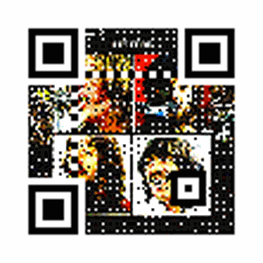
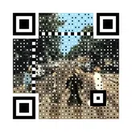
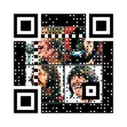
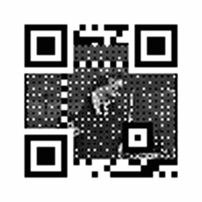
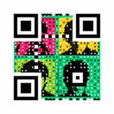

Artistic QR Codes
=================

Segno focuses on creating (Micro) QR codes and offers many
:ref:`output formats <serializers>` without additional dependencies on other
libraries.

Advanced graphic operations require the `qrcode-artistic <https://pypi.org/project/qrcode-artistic/>`_
plug-in, which in turn depends on the `Pillow <https://pypi.org/project/Pillow/>`_ library.

The plugin can be used to create animated QR codes or static QR codes with a
background image.

To install the plugin, use::

    pip install qrcode-artistic

After that, every QR code created with :py:func:`segno.make`, :py:func:`segno.make_qr`
and :py:func:`segno.make_micro` provide two additional methods "to_pil" and "to_artistic".

The former returns a Pillow `Image <https://pillow.readthedocs.io/en/stable/reference/Image.html>`_
instance, which can be used for further manipulations (e.g. rotating the QR code).

.. code-block:: python

    >>> import segno
    >>> qrcode = segno.make('Yellow Submarine', error='h')
    >>> img = qrcode.to_pil(scale=3).rotate(45, expand=True)
    >>> img.save('yellow-submarine-rotated.png')

The "to_pil" method provides all options of :doc:`colorful-qrcodes`.

.. code-block:: python

    >>> import segno
    >>> qrcode = segno.make('Yellow Submarine', error='h')
    >>> img = qrcode.to_pil(scale=4, dark='darkred', data_dark='darkorange',
    ...                    data_light='yellow')
    >>> img.save('yellow-submarine.png')

The "to_artistic" method can create animated or static QR codes.

.. code-block:: python

    >>> import segno
    >>> qrcode = segno.make('The Beatles -- Albums', error='h')
    >>> qrcode.to_artistic(background='src/albums.gif', target='albums.gif', scale=8)

If the Pillow installation supports animated WebP images the plugin can
save animated WebP images as well.

.. code-block:: python

    >>> import segno
    >>> qrcode = segno.make('The Beatles -- Abbey Road', error='h')
    >>> qrcode.to_artistic(background='src/abbey-road-walking.gif',
    ...                    target='abbey-road.webp', scale=4)

The plugin also supports static backgrounds

.. code-block:: python

    >>> import segno
    >>> qrcode = segno.make('The Beatles -- Let It Be', error='h')
    >>> qrcode.to_artistic(background='src/letitbe.jpg', target='letitbe.jpg', scale=5)

It's also possible to write the result into a :py:class:`io.BytesIO` stream if
the ``kind`` parameter is provided:

.. code-block:: python

    >>> import io
    >>> import segno
    >>> qrcode = segno.make('The Beatles -- Let It Be', error='h')
    >>> out = io.BytesIO()
    >>> qrcode.to_artistic(background='src/letitbe.jpg', target=out, scale=5, kind='jpg')

If the background should be specified by a URL use a file-like object:

.. code-block:: python

    >>> from urllib.request import urlopen
    >>> import segno
    >>> qrcode = segno.make('Ringo Starr', error='h')
    >>> url = 'https://media.giphy.com/media/HNo1tVKdFaoco/giphy.gif'
    >>> bg_file = urlopen(url)
    >>> qrcode.to_artistic(background=bg_file, target='ringo.gif', scale=10)

It is possible to combine both techniques so that nothing is written to the
hard drive:

.. code-block:: python

    >>> import io
    >>> from urllib.request import urlopen
    >>> import segno
    >>> qrcode = segno.make('The Beatles', error='h')
    >>> url = 'https://media.giphy.com/media/mUPQmck5YEisg/giphy.gif'
    >>> bg_file = urlopen(url)
    >>> out = io.BytesIO()
    >>> qrcode.to_artistic(background=bg_file, target=out, scale=5, kind='gif')

