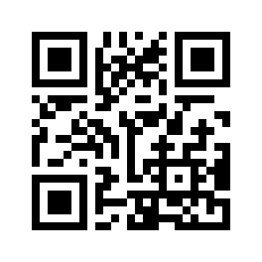

Boost error correction level
============================

If the user does not provide any :option:`--version <segno --version>` or
:paramref:`version <segno.make.version>` keyword parameter for :func:`segno.make`,
Segno uses the minimal possible (Micro) QR Code symbol with a maximal error
correction level. The QR Code version dominates, meaning that Segno will never
choose a better error correction level if this choice requires a higher (Micro)
QR Code version.

If the user provides the :option:`--error <segno --error>` (or
:paramref:`error <segno.make.error>` keyword for :func:`segno.make`), the error
correction level is treated as minimal error correction level.

To prevent any error correction level enhancement, Segno provides the
:option:`--no-error-boost <segno --no-error-boost>` option and
:paramref:`boost_error=False <segno.make.boost_error>` option for :func:`segno.make`.

It's recommended to keep the error level correction boosting, because
a better error correction level improves the probability that the QR Code can be
read by average QR Code decoders under all circumstances.

Examples
--------

Keeping the default (boost error level on)::

    >>> import segno
    >>> qrcode = segno.make('The Long and Winding Road')
    >>> qrcode.designator
    '2-M'

Segno returns a 2-M QR code (version 2, error correction level "M").

If the user does not allow any enhancement of the error correction level, Segno
returns a 2-L QR code (version 2, error correction level "L") which does not
optimally exploit the possible error corrections::

    >>> import segno
    >>> qrcode = segno.make('The Long and Winding Road', boost_error=False)
    >>> qrcode.designator
    '2-L'

As shown, both QR codes use the same version (and are therefore have the same size).
However, the first QR code uses a better error correction level (15% vs. 7%) and
should be easier to read.
