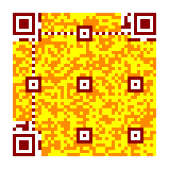

Colorful QR Codes
=================

Almost all serializers support custom settings for the color of the dark and
light modules of a (Micro) QR Code.

The color values can be provided as tuple ``(R, G, B)``, as web color name
(like 'red') or as hexadecimal ``#RRGGBB`` value (i.e. '#085A75'). If alpha
transparency is supported (i.e. :ref:`PNG <png>` and :ref:`SVG <svg>`),
hexadecimal values like ``#RRGGBBAA`` are accepted.

The value ``None`` is accepted by many serialization formats and indicates
transparency, i.e. ``light=None`` to indicate that all light modules should
be transparent.

In almost all cases the color values are automatically converted into a
meaningful value of the specific output format.

The keywords are optional, if not provided, all serializers use a reasonable
default value (dark modules are rendered in black, light modules in white).

.. note:: Providing an alpha channel to a serializer which does not accept an
    alpha channel results usually into an error.

The PNG serializer supports more than two colors, every module type may have
its own color.

.. code-block:: python

    >>> import segno
    >>> # Force version 7 since smaller versions don't carry any version information (see below)
    >>> qr = segno.make('Yellow Submarine', version=7, error='h')
    >>> qr.save('yellow-submarine.png', scale=4, dark='darkred', data_dark='darkorange',
                data_light='yellow')

.. code-block:: python

    >>> import segno
    >>> mqr = segno.make('Rain', error='q')
    >>> mqr.save('rain.png', scale=4, dark='darkblue', data_dark='steelblue')

Color names
-----------

The following examples show the results of all supported module colors.
The unused colors are rendered as grey or white modules, the red modules show
the usage of the keyword.

The keywords "dark" and "light" are supported by almost all serialization
formats.

dark
~~~~

Sets the (default) color of dark modules.

.. image:: _static/colorful/dark.png
    :alt: Picture showing the dark modules

.. image:: _static/colorful/mqr_dark.png
    :alt: Picture showing the dark modules of a Micro QR Code

light
~~~~~

Sets the (default) color of light modules.

.. image:: _static/colorful/light.png
    :alt: Picture showing the light modules

.. image:: _static/colorful/mqr_light.png
    :alt: Picture showing the light modules of a Micro QR Code

alignment_dark
~~~~~~~~~~~~~~

Sets the color of the dark alignment pattern modules.

Micro QR Codes don't have alignment patterns.

.. image:: _static/colorful/alignment_dark.png
    :alt: Picture showing the dark alignment modules

.. image:: _static/colorful/mqr_alignment_dark.png
    :alt: Picture showing the dark alignment modules of a Micro QR Code (None)

alignment_light
~~~~~~~~~~~~~~~

Sets the color of the light alignment pattern modules.

Micro QR Codes don't have alignment patterns.

.. image:: _static/colorful/alignment_light.png
    :alt: Picture showing the light alignment modules

.. image:: _static/colorful/mqr_alignment_light.png
    :alt: Picture showing the light alignment modules of a Micro QR Code (None)

dark_module
~~~~~~~~~~~

Sets the color of the dark module.

Micro QR Codes don't have a dark module.

.. image:: _static/colorful/dark_module.png
    :alt: Picture showing the dark modules

.. image:: _static/colorful/mqr_dark_module.png
    :alt: Picture showing the dark modules of a Micro QR Code (None)

data_dark
~~~~~~~~~

Sets the color of the dark data modules.

.. image:: _static/colorful/data_dark.png
    :alt: Picture showing the dark data modules

.. image:: _static/colorful/mqr_data_dark.png
    :alt: Picture showing the dark data modules of a Micro QR Code

data_light
~~~~~~~~~~

Sets the color of the light data modules.

.. image:: _static/colorful/data_light.png
    :alt: Picture showing the light modules

.. image:: _static/colorful/mqr_data_light.png
    :alt: Picture showing the light modules of a Micro QR Code

finder_dark
~~~~~~~~~~~

Sets the color of the dark modules of the finder pattern.

.. image:: _static/colorful/finder_dark.png
    :alt: Picture showing the dark finder modules

.. image:: _static/colorful/mqr_finder_dark.png
    :alt: Picture showing the dark finder modules of a Micro QR Code

finder_light
~~~~~~~~~~~~

Sets the color of the light modules of the finder pattern.

.. image:: _static/colorful/finder_light.png
    :alt: Picture showing the light finder modules

.. image:: _static/colorful/mqr_finder_light.png
    :alt: Picture showing the light finder modules of a Micro QR Code

format_dark
~~~~~~~~~~~

Sets the color of the dark modules of the format information.

.. image:: _static/colorful/format_dark.png
    :alt: Picture showing the dark format information modules

.. image:: _static/colorful/mqr_format_dark.png
    :alt: Picture showing the dark format information modules of a Micro QR Code (None)

format_light
~~~~~~~~~~~~

Sets the color of the light modules of the format information.

.. image:: _static/colorful/format_light.png
    :alt: Picture showing the light format information modules

.. image:: _static/colorful/mqr_format_light.png
    :alt: Picture showing the light format information modules of a Micro QR Code (None)

quiet_zone
~~~~~~~~~~

Sets the color of the quiet zone.

.. image:: _static/colorful/quiet_zone.png
    :alt: Picture showing the quiet zone

.. image:: _static/colorful/mqr_quiet_zone.png
    :alt: Picture showing the quiet zone of a Micro QR Code

separator
~~~~~~~~~

Sets the color of the separator.

.. image:: _static/colorful/separator.png
    :alt: Picture showing the separator

.. image:: _static/colorful/mqr_separator.png
    :alt: Picture showing the separator of a Micro QR Code

timing_dark
~~~~~~~~~~~

Sets the color of the dark modules of the timing pattern.

.. image:: _static/colorful/timing_dark.png
    :alt: Picture showing the dark timing pattern modules

.. image:: _static/colorful/mqr_timing_dark.png
    :alt: Picture showing the dark timing pattern modules of a Micro QR Code

timing_light
~~~~~~~~~~~~

Sets the color of the light modules of the timing pattern.

.. image:: _static/colorful/timing_light.png
    :alt: Picture showing the light timing pattern modules

.. image:: _static/colorful/mqr_timing_light.png
    :alt: Picture showing the light timing pattern modules of a Micro QR Code

version_dark
~~~~~~~~~~~~

Sets the color of the dark modules of the version information.

Micro QR Codes and QR Codes lesser than version 7 don't carry any version information.

.. image:: _static/colorful/version_dark.png
    :alt: Picture showing the dark version modules

.. image:: _static/colorful/mqr_version_dark.png
    :alt: Picture showing the dark version modules of a Micro QR Code (None)

version_light
~~~~~~~~~~~~~

Sets the color of the light modules of the version information.

Micro QR Codes and QR Codes lesser than version 7 don't carry any version information.

.. image:: _static/colorful/version_light.png
    :alt: Picture showing the light version modules

.. image:: _static/colorful/mqr_version_light.png
    :alt: Picture showing the light version modules of a Micro QR Code (None)
