Colorful QR Codes
=================

Almost all serializers support custom settings for the color of the dark and
light modules of a (Micro) QR code.

The color values can be provided as tuple ``(R, G, B)``, as web color name
(like 'red') or as hexadecimal ``#RRGGBB`` value (i.e. '#085A75'). If alpha
transparency is supported (i.e. :ref:`PNG <png>` and :ref:`SVG <svg>`),
hexadecimal values like ``#RRGGBBAA`` are accepted.

The value ``None`` is accepted by many serialization formats and indicates
transparency, i.e. ``light=None`` indicates that all light modules should
be transparent.

In almost all cases the color values are automatically converted into a
meaningful value of the specific output format.

The keywords are optional, if not provided, all serializers use reasonable
default values (dark modules are rendered in black, light modules in white).

.. note:: Providing an alpha channel to a serializer which does not accept an
    alpha channel results usually into an error.

The :ref:`SVG <svg>`, :ref:`PNG <png>` and :ref:`PPM <ppm>` serializers support
more than two colors, every module type may have its own color.

.. code-block:: python

    >>> import segno
    >>> qrcode = segno.make('Yellow Submarine', version=7, error='h')
    >>> qrcode.save('qrcode_yellow-submarine.png', scale=4, dark='darkred',
    ...             data_dark='darkorange', data_light='yellow')

.. image:: _static/colorful/qrcode_yellow-submarine.png
    :alt: Colorful 7-H QR code encoding "Yellow Submarine"

.. code-block:: python

    >>> import segno
    >>> micro_qrcode = segno.make('Rain', error='q')
    >>> micro_qrcode.save('micro_qrode_rain.png', scale=4, dark='darkblue', data_dark='steelblue')

Module names
------------

The following examples show the results of all supported module types.
The unaffected modules are rendered as grey or white modules, the red modules
show the result of the keyword.

The keywords "dark" and "light" (at the command line  :option:`--dark <segno --dark>`
and :option:`--light <segno --light>`) are supported by almost all serialization
formats.

dark / :option:`--dark <segno --dark>`
~~~~~~~~~~~~~~~~~~~~~~~~~~~~~~~~~~~~~~

Sets the (default) color of dark modules.

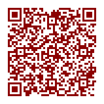

light / :option:`--light <segno --light>`
~~~~~~~~~~~~~~~~~~~~~~~~~~~~~~~~~~~~~~~~~

Sets the (default) color of light modules.

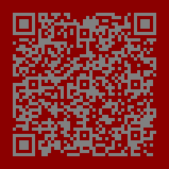

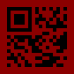

alignment_dark / :option:`--align-dark <segno --align-dark>`
~~~~~~~~~~~~~~~~~~~~~~~~~~~~~~~~~~~~~~~~~~~~~~~~~~~~~~~~~~~~

Sets the color of the dark alignment pattern modules.

Micro QR Codes don't have alignment patterns.

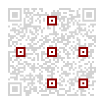

.. image:: _static/colorful/mqr_alignment_dark.png
    :alt: Picture showing the dark alignment modules of a Micro QR code (none)

alignment_light / :option:`--align-light <segno --align-light>`
~~~~~~~~~~~~~~~~~~~~~~~~~~~~~~~~~~~~~~~~~~~~~~~~~~~~~~~~~~~~~~~

Sets the color of the light alignment pattern modules.

Micro QR Codes don't have alignment patterns.

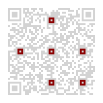

.. image:: _static/colorful/mqr_alignment_light.png
    :alt: Picture showing the light alignment modules of a Micro QR code (none)

dark_module / :option:`--dark-module <segno --dark-module>`
~~~~~~~~~~~~~~~~~~~~~~~~~~~~~~~~~~~~~~~~~~~~~~~~~~~~~~~~~~~

Sets the color of the dark module.

Micro QR Codes don't have a dark module.

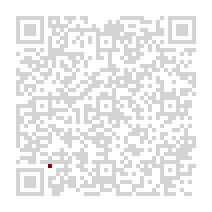

data_dark / :option:`--data-dark <segno --data-dark>`
~~~~~~~~~~~~~~~~~~~~~~~~~~~~~~~~~~~~~~~~~~~~~~~~~~~~~

Sets the color of the dark data modules.

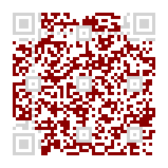

.. image:: _static/colorful/mqr_data_dark.png
    :alt: Picture showing the dark data modules of a Micro QR code

data_light / :option:`--data-light <segno --data-light>`
~~~~~~~~~~~~~~~~~~~~~~~~~~~~~~~~~~~~~~~~~~~~~~~~~~~~~~~~

Sets the color of the light data modules.

.. image:: _static/colorful/data_light.png
    :alt: Picture showing the light modules

finder_dark / :option:`--finder-dark <segno --finder-dark>`
~~~~~~~~~~~~~~~~~~~~~~~~~~~~~~~~~~~~~~~~~~~~~~~~~~~~~~~~~~~

Sets the color of the dark modules of the finder pattern.

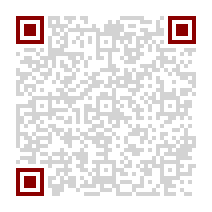

finder_light / :option:`--finder-light <segno --finder-light>`
~~~~~~~~~~~~~~~~~~~~~~~~~~~~~~~~~~~~~~~~~~~~~~~~~~~~~~~~~~~~~~

Sets the color of the light modules of the finder pattern.

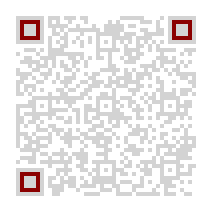

format_dark / :option:`--format-dark <segno --format-dark>`
~~~~~~~~~~~~~~~~~~~~~~~~~~~~~~~~~~~~~~~~~~~~~~~~~~~~~~~~~~~

Sets the color of the dark modules of the format information.

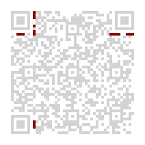

format_light / :option:`--format-light <segno --format-light>`
~~~~~~~~~~~~~~~~~~~~~~~~~~~~~~~~~~~~~~~~~~~~~~~~~~~~~~~~~~~~~~

Sets the color of the light modules of the format information.

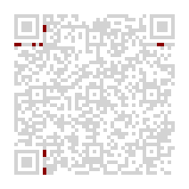

quiet_zone / :option:`--quiet-zone <segno --quiet-zone>`
~~~~~~~~~~~~~~~~~~~~~~~~~~~~~~~~~~~~~~~~~~~~~~~~~~~~~~~~

Sets the color of the quiet zone.

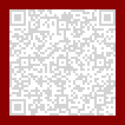

separator / :option:`--separator <segno --separator>`
~~~~~~~~~~~~~~~~~~~~~~~~~~~~~~~~~~~~~~~~~~~~~~~~~~~~~

Sets the color of the separator.

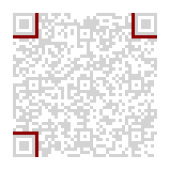

timing_dark / :option:`--timing-dark <segno --timing-dark>`
~~~~~~~~~~~~~~~~~~~~~~~~~~~~~~~~~~~~~~~~~~~~~~~~~~~~~~~~~~~

Sets the color of the dark modules of the timing pattern.

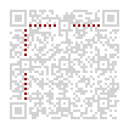

timing_light / :option:`--timing-light <segno --timing-light>`
~~~~~~~~~~~~~~~~~~~~~~~~~~~~~~~~~~~~~~~~~~~~~~~~~~~~~~~~~~~~~~

Sets the color of the light modules of the timing pattern.

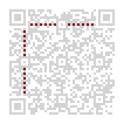

version_dark / :option:`--version-dark <segno --version-dark>`
~~~~~~~~~~~~~~~~~~~~~~~~~~~~~~~~~~~~~~~~~~~~~~~~~~~~~~~~~~~~~~

Sets the color of the dark modules of the version information.

Micro QR Codes and QR Codes lesser than version 7 don't carry any version information.

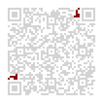

.. image:: _static/colorful/mqr_version_dark.png
    :alt: Picture showing the dark version modules of a Micro QR code (none)

version_light / :option:`--version-light <segno --version-light>`
~~~~~~~~~~~~~~~~~~~~~~~~~~~~~~~~~~~~~~~~~~~~~~~~~~~~~~~~~~~~~~~~~

Sets the color of the light modules of the version information.

Micro QR Codes and QR Codes lesser than version 7 don't carry any version information.

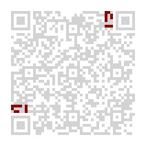

.. image:: _static/colorful/mqr_version_light.png
    :alt: Picture showing the light version modules of a Micro QR code (none)
