QR Code creation from the command line
======================================

The command line script :program:`segno` can be used to print QR codes to the
terminal or to save them in supported formats like SVG, PNG, EPS, …, see
:doc:`CLI man page <man/segno>` for details

By default, the script does not create Micro QR codes, use
:option:`--micro <segno --micro>` to allow the creation of Micro QR codes or
specify the version (like :option:`--version=M3 <segno --version>`) to create
a Micro QR Code.

See the :doc:`CLI man page <man/segno>` for a detailed reference of all command
line options.

Usage
-----

Output the QR code to the terminal::

    $ segno "Little wing"

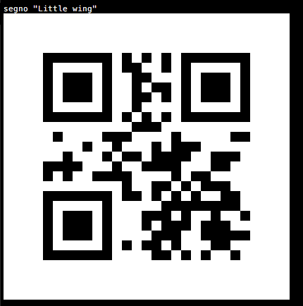

Same content, but as Micro QR code (M4)::

    $ segno --micro "Little wing"

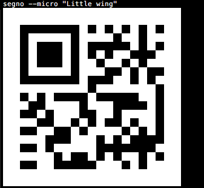

Using a more compact representation of the code::

    $ segno --compact "Little wing"

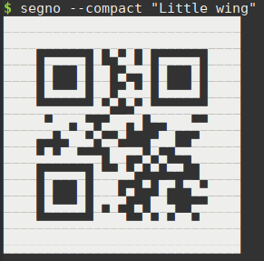

QR Code version
---------------

If the :option:`--version <segno --version>` / :option:`-v <segno -v>`
parameter is not provided, Segno chooses the minimal version for the QR code
automatically. The version may be specified as an integer or as Micro QR Code
identifier.

The content 'Layla' would fit into a 1-H QR code, but the following commands
enforce version 5::

    $ segno --version=5 Layla
    $ segno -v=5 Layla

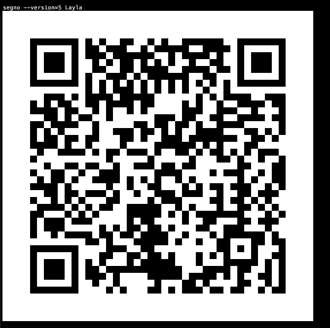

Micro QR Code::

    $ segno -v m4 Layla
    $ segno --version M4 Layla

.. image:: _static/cli/micro-qr-layla-version-m4.png
    :alt: Micro QR code version M4 for "Layla".

QR Code error correction level
------------------------------

The default error correction level is "L" (or any better if
:option:`--no-error-boost <segno --no-error-boost>` was not set, c.f.
:doc:`boost-error-correction-level`), use the
:option:`--error <segno --error>` / :option:`-e <segno -e>` parameter to change it::

    $ segno --error=q "Ain't no grave"
    $ segno -e=h "Heart of Gold"

QR code serialization
---------------------

Printing the QR code to the terminal is nice but the
:option:`--output <segno --output>` / :option:`-o <segno -o>`
parameter serializes the QR code in one of
the supported file formats::

    $ segno --output=white-room.png "White Room"

.. image:: _static/cli/white-room.png
    :alt: QR code "White Room".

::

    $ segno -o=satellite.svg "Satellite Of Love"

.. image:: _static/cli/satellite.svg
    :alt: QR code "Satellite Of Love".

::

    $ segno --output=mrs.eps "Mrs. Robinson"
    $ segno --output=dedodo.pdf "De Do Do Do, De Da Da Da"
    $ segno --output=tin-pan-alley.svgz "Tin Pan Alley"

::

    $ segno --output=thrill-gone.txt "The Thrill Is Gone"

.. include:: _static/cli/thrill-gone.txt
    :literal:

Scaling QR codes
----------------

If the resulting QR code is too small, :option:`--scale <segno --scale>` or
:option:`-s <segno -s>` can be used to create a more appropriate output::

    $ segno --scale=10 --output=money-talks.png "Money Talks"

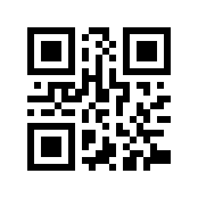

::

    $ segno -s 10 --output=private-investigations.svg Private Investigations

If the serializer does not support a scaling factor (i.e. text output), this
parameter is ignored.

Changing the size of the quiet zone
-----------------------------------

The generated QR code will have a recommended quiet zone / border around the
symbol. To change the size of the border, :option:`--border <segno --border>`
or the shortcut :option:`-b <segno -b>` can be utilized::

    $ segno --border 0 --scale 4 --output=black-magic-woman.svg "Black Magic Woman"

::

    $ segno --border 10 --scale 4 --output diamond.png "Shine On You Crazy Diamond"

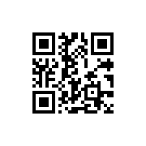

::

    $ segno -b 30 --scale 4 --output=boom-boom.svg Boom Boom

Colors
------

Usually, all QR codes are serialized in black and white. Use
:option:`--dark <segno --dark>` to change the color of the dark modules and
:option:`--light <segno --light>` to change the color of the light modules.

Change the color of the dark modules to to darkblue::

    $ segno --dark=darkblue --scale 4 --output=excited.png "So Excited"

Change the color of the light modules to transparent::

    $ segno --light=transparent --scale 4 --output=hotel.png "Hotel California"

.. image:: _static/cli/hotel.png
    :alt: QR code "Hotel California" with background color "transparent"

Change the color of the dark modules to darkblue and the color of the light
modules to yellow::

    $ segno --dark=darkblue --light=yellow --scale 4 --output=dontgiveup.svg "Don't Give Up"

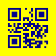

If the serializer does not support :option:`--color <segno --dark>` or
:option:`--light <segno --light>`, these arguments are ignored.

The :ref:`SVG <svg>`, :ref:`PNG <png>` and :ref:`PPM <ppm>` serializers support
more than two colors, each module type (finder pattern (dark / light),
alignment pattern (dark / light) etc.) may have its own color, see
:doc:`colorful-qrcodes` for details.

.. code-block:: bash

    $ segno --dark darkred --data-dark darkorange --data-light yellow --scale 5 -o qrcode_yellow-submarine.png Yellow Submarine

.. image:: _static/colorful/qrcode_yellow-submarine.png
    :alt: QR code "Yellow Submarine" colorful

Structured Append
-----------------

The :doc:`Structured Append <structured-append>` mode can be used to split a
message across multiple (max. 16) QR codes.

To create a sequence of QR codes, the :option:`--seq <segno --seq>` argument must
be provided. Additionally, either the :option:`--version <segno --version>`
or the desired number of symbols (:option:`--symbol-count <segno --symbol-count>`) must be provided::

    $ segno --seq -v 1 --scale 3 -o polythene-pam.png "Well you should see Polythene Pam"

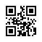

.. image:: _static/polythene-pam-03-02.png
    :alt: 2nd part of Structured Append code

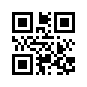

Specify the max. number of symbols::

    $ segno --seq --symbol-count=2 -s 3 -o sa_yellow-submarine.png "We all live in a yellow submarine"

.. image:: _static/cli/sa_yellow-submarine-02-01.png
    :alt: 1st part of Structured Append code

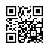

Shortcut to specify the number of symbols::

    $ segno --seq -sc 2 -s 3 -o julia.png "Half of what I say is meaningless"

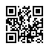

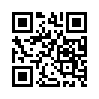
