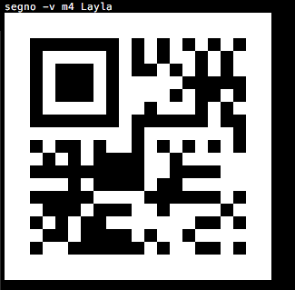
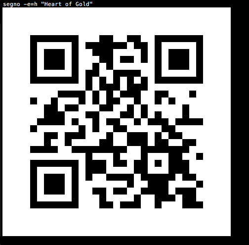
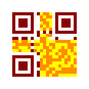
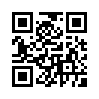

QR Code creation from the command line
======================================

The command line script :program:`segno` can be used to print QR Codes to the
terminal or to save them as file (SVG, PNG, EPS, ...).

By default, the script does not create Micro QR Codes, use
:option:`--micro <segno --micro>` to allow the creation of Micro QR Codes or
specify the version (like :option:`--version=M3 <segno --version>`) to create
a Micro QR Code.

See the :doc:`CLI man page <man/segno>` for a detailed reference of all command line options.

Usage
-----

Output the QR Code to the terminal::

    $ segno "Little wing"

.. image:: _static/qr-little-wing-terminal.png
    :alt: QR Code for "Little wing".

Same content, but as Micro QR Code (M4)::

    $ segno --micro "Little wing"

.. image:: _static/micro-qr-little-wing-terminal.png
    :alt: Micro QR Code for "Little wing".

Version
-------

If the :option:`--version <segno --version>` parameter is not provided, Segno
chooses the minimal version for the QR Code automatically. The version may be
specified as integer or as Micro QR Code identifier.

The content 'Layla' would fit into a version 1 QR Code, but the following command
enforces version 5::

    $ segno --version=5 Layla
    $ segno -v=5 Layla

.. image:: _static/qr-layla-version-5.png
    :alt: QR Code version 5 for "Layla".

Micro QR Code::

    $ segno -v m4 Layla
    $ segno --version M4 Layla

Error correction level
----------------------

The default error correction level is "L" (or any better if
:option:`--no-error-boost <segno --no-error-boost>` was not set, c.f.
:doc:`boost-error-correction-level`), use the
:option:`--error <segno --error>` parameter to change it::

    $ segno --error=q "Ain't no grave"
    $ segno -e=h "Heart of Gold"

"Heart of Gold" using error level "L":

.. image:: _static/qr-heart-of-gold-error-l.png
    :alt: QR Code "Heart of Gold" using error level L

"Heart of Gold" using error level "H":

QR Code serialization
---------------------

Printing the QR Codes to the terminal is nice but the
:option:`--output <segno --output>` parameter serializes the QR Code in one of
the supported file formats::

    $ segno --output=white-room.png "White Room"

.. image:: _static/white-room.png
    :alt: QR Code "White Room".

::

    $ segno -o=satellite.svg "Satellite Of Love"

.. image:: _static/satellite.svg
    :alt: QR Code "Satellite Of Love".

::

    $ segno --output=mrs.eps "Mrs. Robinson"
    $ segno --output=dedodo.pdf "De Do Do Do, De Da Da Da"
    $ segno --output=tin-pan-alley.svgz "Tin Pan Alley"

::

    $ segno --output=thrill-gone.txt "The Thrill Is Gone"

.. include:: _static/thrill-gone.txt
    :literal:

Scaling QR Codes
----------------

If the resulting QR Code is too small, :option:`--scale <segno --scale>` can
be used to create a more appropriate output::

    $ segno --scale=10 --output=money-talks.png "Money Talks"

.. image:: _static/money-talks.png
    :alt: QR Code "Money Talks".

::

    $ segno -s 10 --output=private-investigations.svg Private Investigations

.. image:: _static/private-investigations.svg
    :alt: QR Code "Private Investigations".

If the serializer does not support a scaling factor (i.e. text output), this
parameter is ignored.

Changing the size of the quiet zone
-----------------------------------

The generated QR Codes will have a recommended quiet zone / border around the
symbol. To change the size of the border, :option:`--border <segno --border>`
can be utilized::

    $ segno --border=0 --output=black-magic-woman.svg "Black Magic Woman"

::

    $ segno --border=10 --output=diamond.png "Shine On You Crazy Diamond"

::

    $ segno -b=30 --output=boom-boom.svg Boom Boom

Colors
------

Usually, all QR Codes are serialized in black and white. Use
:option:`--dark <segno --dark>` to change the color of the dark modules and
:option:`--light <segno --light>` to change the color of the light modules.

Change the foreground color to darkblue::

    $ segno --dark=darkblue --output=excited.png "So Excited"

Change the background color to transparent::

    $ segno --light=transparent --output=hotel.png "Hotel California"

.. image:: _static/hotel.png
    :alt: QR Code "Hotel California" with background color "transparent"

Change the foreground color to darkblue and background to yellow::

    $ segno --dark=darkblue --light=yellow --output=dontgiveup.svg "Don't Give Up"

If the serializer does not support :option:`--color <segno --dark>` or
:option:`--light <segno --light>`, these arguments are ignored.

The PNG serializer supports more than two colors, each module type (finder pattern
(dark / light), alignment pattern (dark / light) etc.) may have its own color::

    $ segno --dark darkred --data-dark darkorange --data-light yellow --scale 5 -o yellow-submarine.png Yellow Submarine

Structured Append
-----------------

The :doc:`Structured Append <structured-append>` mode can be used to split a
message across multiple (max. 16) QR Codes.

To create a sequence of QR Codes, the :option:`--seq <segno --seq>` argument must
be provided. Additonally, either the QR Code :option:`--version <segno --version>`
or the desired number of symbols (:option:`--symbol-count <segno --symbol-count>`) must be provided::

    $ segno --seq -v 1 --scale 3 -o polythene-pam.png "Well you should see Polythene Pam"

.. image:: _static/polythene-pam-03-01.png
    :alt: 1st part of Structured Append code

.. image:: _static/polythene-pam-03-02.png
    :alt: 2nd part of Structured Append code

.. image:: _static/polythene-pam-03-03.png
    :alt: 3nd part of Structured Append code

Specify the max. number of symbols::

    $ segno --seq --symbol-count=2 -s 3 -o sa_yellow-submarine.png "We all live in a yellow submarine"

.. image:: _static/sa_yellow-submarine-02-02.png
    :alt: 2nd part of Structured Append code

Shortcut to specify the number of symbols::

    $ segno --seq -sc 2 -s 3 -o julia.png "Half of what I say is meaningless"

.. image:: _static/julia-02-01.png
    :alt: 1st part of Structured Append code

.. image:: _static/julia-02-02.png
    :alt: 2nd part of Structured Append code
