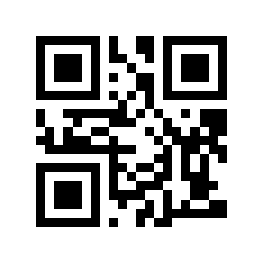
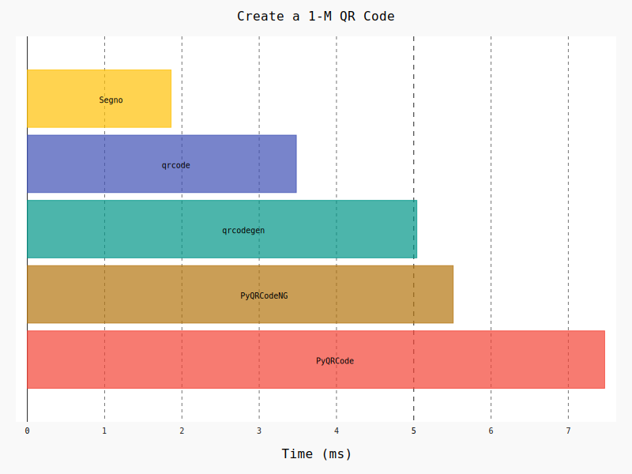
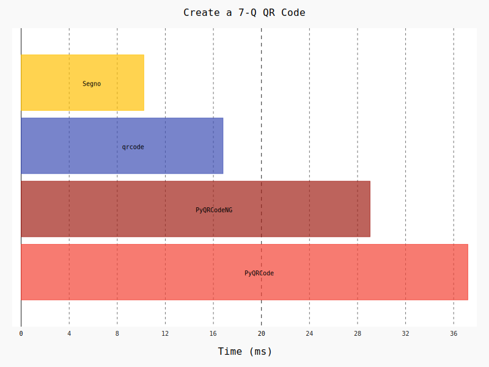
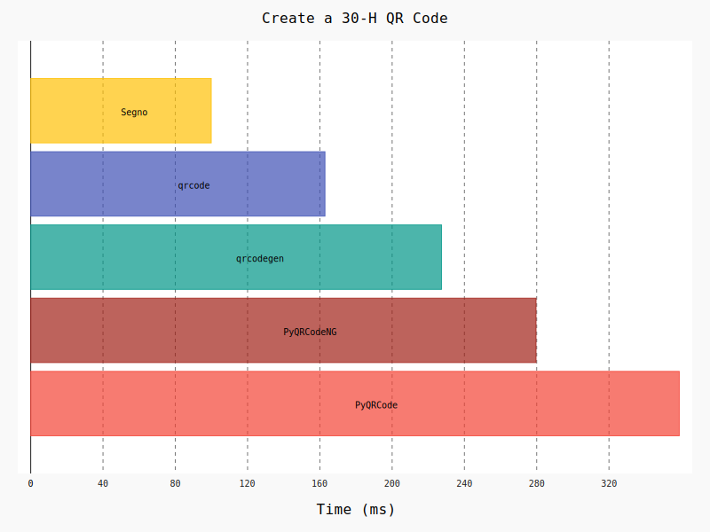
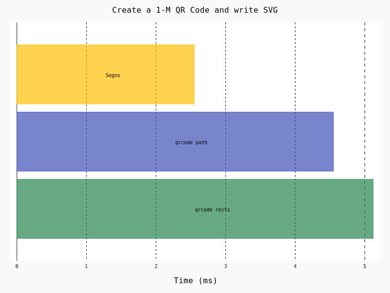
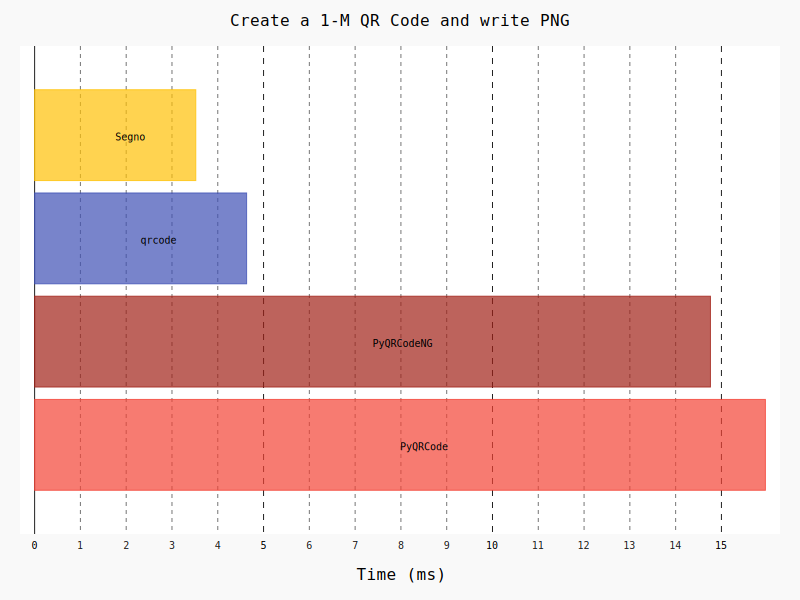

Comparison of Python QR Code libraries
======================================

Features
--------

============================================    ==================    ===================    ===================    ==================    ========
Description                                     `qrcode`_             `PyQRCode`_            `PyQRCodeNG`_          `qrcodegen`_          `Segno`_
============================================    ==================    ===================    ===================    ==================    ========
Library license                                 `BSD`_                `BSD`_                 `BSD`_                 `MIT`_                `BSD`_
Library version                                 6.1                   1.2.0                  1.3.4                  1.3.0                 |version|
Mode Numeric                                    Yes                   Yes                    Yes                    Yes                   Yes
Mode Alphanumeric                               Yes                   Yes                    Yes                    Yes                   Yes
Mode Byte                                       Yes                   Yes                    Yes                    Yes                   Yes
Mode Kanji                                      No                    Yes                    Yes                    No                    Yes
Mode ECI                                        No                    No                     No                     Yes                   Yes
Mode FNC1                                       No                    No                     No                     No                    No
Mode Structured Append                          No                    No                     No                     No                    Yes
Mixing modes                                    Yes                   No                     No                     Yes                   Yes
QR Codes version 1 - 40                         Yes                   Yes                    Yes                    Yes                   Yes
Micro QR Codes version M1 - M4                  No                    No                     No                     No                    Yes
Output acc. to ISO/IEC 18004:2015(E) Fig. 1     No                    No                     No                     No                    Yes
Output acc. to ISO/IEC 18004:2015(E) I.3.       No (not available)    No (not available)     No (not available)     No (not available)    Yes
Find maximal error correction level             No                    No                     No                     Yes                   Yes
Optimize QR Codes                               Yes                   No                     No                     No                    No
`PNG`_ output                                   Yes                   Yes                    Yes                    No                    Yes
`SVG`_ output                                   Yes                   Yes                    Yes                    Yes                   Yes
`EPS`_ output                                   Yes                   Yes                    Yes                    No                    Yes
`PDF`_ output                                   Yes                   No                     No                     No                    Yes
`XBM`_ output                                   Yes                   Yes                    Yes                    No                    Yes
`XPM`_ output                                   No                    No                     No                     No                    Yes
`PBM`_ output                                   Yes                   No                     No                     No                    Yes
`PAM`_ output                                   No                    No                     No                     No                    Yes
`LaTeX`_ support                                No                    No                     No                     No                    Yes
PNG `data URI`_                                 No                    No (no valid URI)      Yes                    No                    Yes
SVG data URI                                    No                    No                     No                     No                    Yes
Text output                                     Yes                   Yes                    Yes                    No                    Yes
`ANSI`_ escape code output                      Yes                   Yes                    Yes                    No                    Yes
Other output formats (i.e. `JPEG`_)             Yes                   No                     No                     No                    No, but via `PIL plugin`_
Black and white QR Codes                        Yes                   Yes                    Yes                    Yes                   Yes
Colored QR Codes                                Yes                   Yes                    Yes                    No                    Yes
Animated QR Codes (`GIF`_, `APNG`_)             No                    No                     No                     No                    No
Changing size of modules (scaling factor)       Yes                   Yes                    Yes                    No                    Yes
Command line script                             Yes                   No                     Yes                    No                    Yes
Plugins                                         No                    No                     No                     No                    Yes
Default encoding in Byte mode                   ISO/IEC 8859-1        ISO/IEC 8859-1         ISO/IEC 8859-1         ISO/IEC 8859-1        ISO/IEC 8859-1
                                                or UTF-8              or UTF-8               or UTF-8               or UTF-8              or UTF-8
3rd party dependencies                          `six`_,               `PyPNG`_               `PyPNG`_               -                     -
                                                `Pillow`_ or
                                                `Pymaging`_ and
                                                `Pymaging-PNG`_
                                                (Windows:
                                                `colorama`_)
============================================    ==================    ===================    ===================    ==================    ========

Output according ISO/IEC 18004:2015(E)
--------------------------------------

On page 7 of the standard, the following 1-M QR Code encoding "QR Code Symbol" is
shown:

Even if all libs generate the same byte output (``40 e5 15 22 04 36 f6 46 52 05 37 96 d6 26 f6 c0``),
the generated QR Code may look different because they may use a different mask
pattern (see ISO/IEC 18004:2015(E) - 7.8.3 Evaluation of data masking results).

While Segno chooses mask pattern 5 which generates the same result as shown
in the ISO/IEC 18004:2015(E) standard:

qrcode and qrcodegen choose mask pattern 4:

and PyQRCode/ PyQRCodeNG choose mask pattern 6:

Performance
-----------

Some performance indicators. The script `benchmarks.py`_ ran on a
Mac Mini 2,26 Core2 Duo using CPython 2.7.15. Each SVG / PNG image uses a
scaling factor of 10 (aside from qrcodegen which does not support any scaling).

Create a 1-M QR Code
~~~~~~~~~~~~~~~~~~~~

1-M QR Code encoding "QR Code Symbol"

Create a 7-Q QR Code
~~~~~~~~~~~~~~~~~~~~

7-Q QR Code encoding "QR Code Symbol"

Create a 30-H QR Code
~~~~~~~~~~~~~~~~~~~~~

30-H QR Code encoding "QR Code Symbol"

Create a QR Code and serialize it as SVG
^^^^^^^^^^^^^^^^^^^^^^^^^^^^^^^^^^^^^^^^

Create a QR Code 1-M "QR Code Symbol" and serialize it as SVG document.

Create a QR Code and serialize it as PNG
^^^^^^^^^^^^^^^^^^^^^^^^^^^^^^^^^^^^^^^^

Create a QR Code 1-M "QR Code Symbol" and serialize it as PNG image.

.. _qrcode: https://pypi.org/project/qrcode/
.. _PyQRCode: https://pypi.org/project/PyQRCode/
.. _PyQRCodeNG: https://pypi.org/project/PyQRCodeNG/
.. _qrcodegen: https://pypi.org/project/qrcodegen/
.. _Segno: https://pypi.org/project/segno/
.. _BSD: http://opensource.org/licenses/BSD-3-Clause
.. _MIT: http://opensource.org/licenses/MIT
.. _PNG: https://en.wikipedia.org/wiki/Portable_Network_Graphics
.. _SVG: https://en.wikipedia.org/wiki/Scalable_Vector_Graphics
.. _EPS: https://en.wikipedia.org/wiki/Encapsulated_PostScript
.. _PDF: https://en.wikipedia.org/wiki/Portable_Document_Format
.. _XBM: https://en.wikipedia.org/wiki/X_BitMap
.. _XPM: https://de.wikipedia.org/wiki/X_PixMap
.. _PBM: https://en.wikipedia.org/wiki/Netpbm_format
.. _PAM: https://en.wikipedia.org/wiki/Netpbm#PAM_graphics_format
.. _LaTeX: https://en.wikipedia.org/wiki/LaTeX
.. _data URI: https://en.wikipedia.org/wiki/Data_URI_scheme
.. _ANSI: https://en.wikipedia.org/wiki/ANSI_escape_code
.. _JPEG: https://en.wikipedia.org/wiki/JPEG
.. _six: https://pypi.org/project/six/
.. _PyPNG: https://pypi.org/project/pypng/
.. _Pymaging: https://github.com/ojii/pymaging
.. _Pymaging-PNG: https://github.com/ojii/pymaging-png
.. _PIL: https://pypi.org/project/PIL/
.. _Pillow: https://pypi.org/project/Pillow/
.. _colorama: https://pypi.org/project/colorama/
.. _PIL plugin: https://github.com/heuer/segno-pil
.. _benchmarks.py: https://github.com/heuer/segno/blob/master/sandbox/benchmarks.py
.. _GIF: https://en.wikipedia.org/wiki/GIF#Animated_GIF
.. _APNG: https://en.wikipedia.org/wiki/Animated_Portable_Network_Graphics
