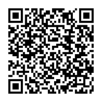

EPC QR Codes
============

European Payments Council Quick Response Codes (EPC QR Codes) are used to
initiate SEPA credit transfers. They encode all necessary data (IBAN, amount,
recipient) and may be placed on invoices to eliminate the error-prone typing
of payment Information.

See the `EPC guidelines (PDF document) <https://www.europeanpaymentscouncil.eu/sites/default/files/KB/files/EPC069-12%20v2.1%20Quick%20Response%20Code%20-%20Guidelines%20to%20Enable%20the%20Data%20Capture%20for%20the%20Initiation%20of%20a%20SCT.pdf>`_
for more information.

The function :py:func:`segno.helpers.make_epc_qr` is used to create a EPC QR code.
It is not possible to modify the error correction level or to change the version
of the QR code. The EPC guidelines specify that the error correction level is
fixed to "M" and the QR Code version must not be higher than 13.

.. code-block:: python

    >>> from segno import helpers
    >>> qrcode = helpers.make_epc_qr(name='Wikimedia Foerdergesellschaft',
    ...                              iban='DE33100205000001194700',
    ...                              amount=20, text='Spende fuer Wikipedia')
    >>> qrcode.save('spende-wikipedia.png', scale=3)

The QR code shown above encodes the following information::

    BCD
    002
    2
    SCT

    Wikimedia Foerdergesellschaft
    DE33100205000001194700
    EUR20

    Spende fuer Wikipedia

By default, the function uses the minimal possible encoding to encode the
provided data. If another encoding, i.e. UTF-8, is required, the user may specify
the encoding with an integer referring to one of the supported encodings
(1: UTF-8, 2: ISO 8859-1, 3: ISO 8859-2, 4: ISO 8859-4, 5: ISO 8859-5,
6: ISO 8859-7, 7: ISO 8859-10, 8: ISO 8859-15) or the (case insensitive) name
of the encoding like 'utf-8' or 'ISO-8859-1'.

.. code-block:: python

    >>> from segno import helpers
    >>> qrcode = helpers.make_epc_qr(name='Wikimedia Foerdergesellschaft',
    ...                              iban='DE33100205000001194700', amount=13.05,
    ...                              text='Spende fuer Wikipedia', encoding='utf-8')
    >>> qrcode.save('spende-wikipedia2.png', scale=3)

.. image:: _static/epc/spende-wikipedia2.png
    :alt: EPC QR Code

Decoded infomation::

    BCD
    002
    1
    SCT

    Wikimedia Foerdergesellschaft
    DE33100205000001194700
    EUR13.05

    Spende fuer Wikipedia

