Creating QR codes or Micro QR codes
===================================

Segno's (Micro) QR codes are independent of a concrete output format; it's
possible to create more than one rendering (output format) from a single QR code
or Micro QR code:

.. code-block:: python

    >>> import segno
    >>> qrcode = segno.make('Henry Lee')
    >>> qrcode.save('henry-lee.svg')  # SVG document
    >>> qrcode.save('henry-lee.png')  # PNG image
    >>> qrcode.save('henry-lee.eps')  # EPS document
    >>> qrcode.save('henry-lee.txt')  # Text output

By default, the serialized (Micro) QR codes are black and white (or transparent)
and have a quiet zone (border) of four (or two for Micro QR Codes) light modules.
Nearly all output formats provide options to change at least the scale of the
code, the color of the dark modules, and the border, see
:py:func:`segno.QRCode.save()` and :doc:`serializers` for details.

.. code-block:: python

    >>> import segno
    >>> qrcode = segno.make('You Know My Name (Look Up The Number)')
    >>> qrcode.save('you-know-my-name-no-border.svg', border=0)  # no border / quiet zone
    >>> qrcode.save('you-know-my-name-color-green.svg',
    ...             dark='green')  # default border, dark modules are green
    >>> qrcode.save('you-know-my-name-background-grey.svg',
    ...             light='#eee')  # default border, background grey

The factory function :py:func:`segno.make` chooses the minimal possible (Micro) QR Code
version with a maximal error correction for the provided input.

.. code-block:: python

    >>> import segno
    >>> qrcode = segno.make('Rain')
    >>> qrcode.version
    'M3'

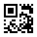

The caller may enforce that a QR Code instead of a Micro QR Code should be
generated even if the content may fit into a Micro QR Code.

.. code-block:: python

    >>> import segno
    >>> qrcode = segno.make('Rain', micro=False)
    >>> qrcode.version
    1

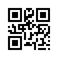

Further, Segno provides two additional factory functions to enforce the creation
of QR Codes or Micro QR Codes: :py:func:`segno.make_qr` for QR Codes and
:py:func:`segno.make_micro` to create Micro QR Codes:

.. code-block:: python

    >>> import segno
    >>> micro_qrcode = segno.make_micro('The Beatles')  # Micro QR Code
    >>> micro_qrcode.designator  # Get the version and error level
    'M4-M'

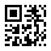

.. code-block:: python

    >>> import segno
    >>> qrcode = segno.make_qr('The Beatles')  # Same content but as QR Code
    >>> qrcode.designator
    '1-Q'

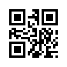

.. code-block:: python

    >>> import segno
    >>> qrcode = segno.make('The Beatles', micro=False)  # Disallow Micro QR Codes
    >>> qrcode.designator
    '1-Q'

If the provided content is too large, a :py:exc:`segno.DataOverflowError` is
thrown:

.. code-block:: python

    >>> import segno
    >>> qrcode = segno.make_micro('The Curse of Millhaven')
    Traceback (most recent call last):
        ...
    DataOverflowError: Data too large. No Micro QR Code can handle the provided data

QR Code version
---------------

It's possible to specify the desired version for the provided ``content``.

.. code-block:: python

    >>> import segno
    >>> qrcode = segno.make('Light My Fire')
    >>> qrcode.version
    'M4'
    >>> qrcode.designator
    'M4-M'

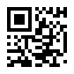

.. code-block:: python

    >>> import segno
    >>> qrcode = segno.make('Light My Fire', version=1)
    >>> qrcode.version
    1
    >>> qrcode.designator
    '1-M'

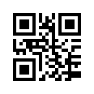

QR Code error correction level
------------------------------

By default, Segno uses at minimum the error correction level "L" to encode
a (Micro) QR code.

Segno tries by default to enhance the provided error correction level if
:paramref:`boost_error <segno.make.boost_error>` is not set to ``False``;
it takes  the ``error`` level as minimum error level without changing the
(Micro) QR Code version, c.f. :doc:`boost-error-correction-level` for details.

If this behaviour is not desired, :paramref:`boost_error <segno.make.boost_error>`
must be set to ``False`` (default: ``True``).

Use the parameter :paramref:`error <segno.make.error>` to change the (minimum)
error correction level.

The `error` parameter is case-insensitive. Available error correction levels are
``L`` (lowest error correction level: 7% of codewords can be restored), ``M``
(error correction level "medium": 15% of codewords can be restored), ``Q``
(error correction level "quartile": 25% of codewords can be restored),  and ``H``
(highest error correction level: 30% of codewords can be restored). The error
correction level "H" is not available for Micro QR Codes, if the user specifies
the error correction level "H", a QR code is generated by :py:func:`segno.make`,
never a Micro QR code.

.. code-block:: python

    >>> import segno
    >>> qrcode = segno.make('Parisienne Walkways',
    ...                     error='l')  # Explicit (minimum) error correction level
    >>> qrcode.designator # The error correction level was changed to "Q" since there was enough available space
    '2-Q'

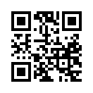

.. code-block:: python

    >>> import segno
    >>> qrcode = segno.make('Parisienne Walkways', error='l',
    ...                     boost_error=False)  # Explicit error level
    >>> qrcode.designator
    '2-L'

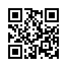

.. code-block:: python

    >>> import segno
    >>> # Enhancing the error correction level may enforce another QR Code version
    >>> qrcode = segno.make('Parisienne Walkways', error='H')
    >>> qrcode.designator
    '3-H'

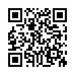

QR Code data masking
--------------------

Segno chooses by default an optimal mask for the provided input, but the user
may specify the preferred mask as well. QR Codes support 8 mask patterns, while
Micro QR Codes support 4 mask patterns, only.

.. code-block:: python

    >>> import segno
    >>> qrcode = segno.make('Ai Du')
    >>> qrcode.mask
    0
    >>> qrcode = segno.make('Ai Du', mask=3)
    >>> qrcode.mask
    3

Micro QR code with different data masks
^^^^^^^^^^^^^^^^^^^^^^^^^^^^^^^^^^^^^^^

M3-M codes encoding "Ai Du" with the four different masks:

.. figure:: _static/data_mask_mqr_0.svg

    Micro QR Code using data mask pattern 00 (mask=0)

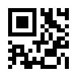

    Micro QR Code using data mask pattern 01 (mask=1)

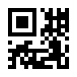

    Micro QR Code using data mask pattern 10 (mask=2)

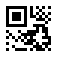

    Micro QR Code using data mask pattern 11 (mask=3)

QR code with different data masks
^^^^^^^^^^^^^^^^^^^^^^^^^^^^^^^^^

1-H codes encoding "Ai Du" using the eight different mask patterns:

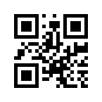

    QR Code using data mask pattern 000 (mask=0)

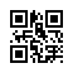

    QR Code using data mask pattern 001 (mask=1)

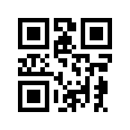

    QR Code using data mask pattern 010 (mask=2)

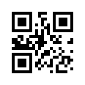

    QR Code using data mask pattern 011 (mask=3)

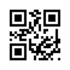

    QR Code using data mask pattern 100 (mask=4)

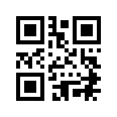

    QR Code using data mask pattern 101 (mask=5)

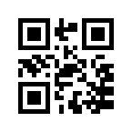

    QR Code using data mask pattern 110 (mask=6)

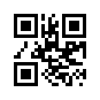

    QR Code using data mask pattern 111 (mask=7)
