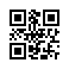
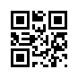
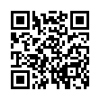
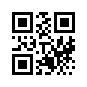

QR Code modes
=============

The ISO/IEC 18004 standard defines four modes in order to encode the data as
efficiently as possible. If no encoding or mode is provided, Segno tries to
find the most efficient encoding / mode.

The mode may be specified by the :paramref:`mode <segno.make.mode>`
(CLI: :option:`--mode <segno --mode>` or :option:`-m <segno -m>`) parameter
although it is recommended to let Segno decide which mode / encoding should be used.

.. _numeric-mode:

Numeric mode
------------

The numeric mode is the most efficient way to encode digits.
This mode does not cover negative numbers because it does not support
the minus sign (or plus sign).

The numeric mode is supported by QR Codes and Micro QR Codes.

Segno detects the numeric mode if the data is provided as string or integer:

.. code-block:: python

    >>> import segno
    >>> qrcode = segno.make('64')
    >>> qrcode2 = segno.make(64)
    >>> qrcode.designator
    'M1'
    >>> qrcode2.designator
    'M1'
    >>> qrcode.mode
    'numeric'
    >>> qrcode2.mode
    'numeric'
    >>> qrcode == qrcode2
    True

.. image:: _static/modes/64-micro.png
    :alt: M1 Micro QR Code encoding "64"

Segno chooses by default a minimal QR Code output. Since the numeric
mode is supported by Micro QR Codes and QR Codes, Segno chooses a Micro
QR Code as most efficient representation.

To enforce a QR Code, use either the factory function :py:func:`segno.make_qr`
or set the :paramref:`micro <segno.make.micro>` parameter of :py:func:`segno.make` to ``False``:

.. code-block:: python

    >>> import segno
    >>> qrcode = segno.make_qr('64')
    >>> qrcode2 = segno.make(64, micro=False)
    >>> qrcode.designator
    '1-H'
    >>> qrcode.mode
    'numeric'
    >>> qrcode == qrcode2
    True

.. image:: _static/modes/64.png
    :alt: 1-H QR Code encoding "64"

Alphanumeric mode
-----------------

The alphanumeric mode extends the :ref:`numeric-mode` by various characters.
Namely about the upper case letters ``ABCDEFGHIJKLMNOPQRSTUVWXYZ``,
a space character " " and other letters ``$%*+-./:``.

.. code-block:: python

    >>> import segno
    >>> qrcode = segno.make('REVOLUTION NO. 9')
    >>> qrcode.designator
    'M4-M'
    >>> qrcode.mode
    'alphanumeric'

.. image:: _static/modes/REVOLUTION9-micro.png
    :alt: M4-M Micro QR Code encoding "REVOLUTION NO. 9"

As stated in :ref:`numeric-mode`, Segno tries to find the smallest possible code.
To ensure a QR Code (and not a Micro QR Code), use the above mentioned factory
functions:

.. code-block:: python

    >>> import segno
    >>> qrcode = segno.make_qr('REVOLUTION NO. 9')
    >>> qrcode.designator
    '1-Q'
    >>> qrcode.mode
    'alphanumeric'
    >>> qrcode2 = segno.make('REVOLUTION NO. 9', micro=False)
    >>> qrcode2.designator
    '1-Q'
    >>> qrcode2.mode
    'alphanumeric'

Lower case characters are not covered by the alphanumeric mode, but by
the :ref:`byte-mode`

.. code-block:: python

    >>> import segno
    >>> qrcode = segno.make('Revolution No. 9')
    >>> qrcode.mode
    'byte'

Kanji mode
----------

Kanji can be encoded compactly and efficiently and requires significantly less
space than encoding the characters in UTF-8.

.. code-block:: python

    >>> import segno
    >>> qrcode = segno.make('ビートルズ')
    >>> qrcode.designator
    'M3-L'
    >>> qrcode.mode
    'kanji'

.. image:: _static/modes/kanji-micro.png
    :alt: M3-L Micro QR Code encoding "ビートルズ"

.. code-block:: python

    >>> import segno
    >>> qrcode = segno.make_qr('ビートルズ')
    >>> qrcode.designator
    '1-Q'
    >>> qrcode.mode
    'kanji'

.. image:: _static/modes/kanji-qrcode.png
    :alt: 1-Q QR Code encoding "ビートルズ"

.. _byte-mode:

Byte mode
---------

The byte mode covers all data which cannot be represented by the other
modes. Segno tries, according to ISO/IEC 18004, to encode the data
with ISO 8859-1. In case the data cannot be represented by ISO 8859-1,
UTF-8 is used as fallback.

.. code-block:: python

    >>> import segno
    >>> qrcode = segno.make('Turn off your mind relax and float down stream')
    >>> qrcode.designator
    '3-L'
    >>> qrcode.mode
    'byte'

The byte mode is also supported by Micro QR Code M3 and M4:

.. code-block:: python

    >>> import segno
    >>> qrcode = segno.make('Let it be')
    >>> qrcode.designator
    'M3-L'
    >>> qrcode.mode
    'byte'

.. _hanzi-mode:

Hanzi mode
----------

The Hanzi mode is not covered by ISO/IEC 18004 and should be used with
care since it is not widely supported by QR Code readers, although the
`ZXing <https://zxing.org/>`_ project supports decoding QR Codes which
utilize the Hanzi mode.

.. note::
    Since this mode is not covered by the ISO standard, Segno tries not to
    detect Hanzi. The user has to enable it explicitly. Further, the Hanzi
    mode is not available for Micro QR Codes.

.. code-block:: python

    >>> import segno
    >>> qrcode = segno.make('书读百遍其义自现')
    >>> qrcode.designator
    '2-M'
    >>> qrcode.mode
    'byte'

The QR Code uses the :ref:`byte-mode` because no other mode fits.

.. image:: _static/modes/hanzi-byte.png
    :alt: 2-M QR Code encoding "书读百遍其义自现" in byte mode

To enable Hanzi, provide the mode in the factory function:

.. code-block:: python

    >>> import segno
    >>> qrcode = segno.make('书读百遍其义自现', mode='hanzi')
    >>> qrcode.mode
    'hanzi'
    >>> qrcode.designator
    '1-M'

As shown, the input is encoded much more compact and a 1-M instead of a
2-M QR Code is generated.

