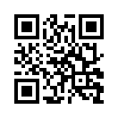
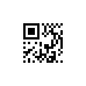
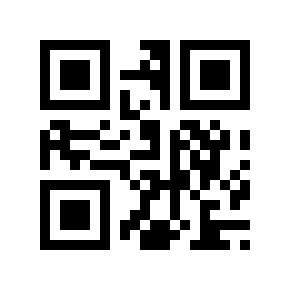
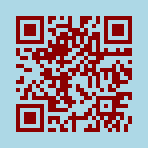
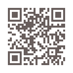


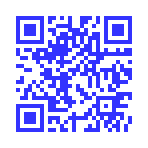
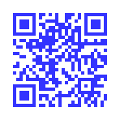
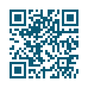

QR code and Micro QR code serialization
=======================================

A QR code or Micro QR code is independent of its output, it's just a matrix.
To save a QR code or Micro QR code, Segno provides several output formats.

Segno provides a :py:func:`segno.QRCode.save` method to serialize a (Micro)
QR code in different formats:

.. code-block:: python

    >>> import segno
    >>> qrcode = segno.make('Tomorrow Never Knows')
    >>> qrcode.save('tomorrow-never-knows.svg')
    >>> qrcode.save('tomorrow-never-knows.png')
    >>> qrcode.save('tomorrow-never-knows.eps')

Border
------

All serializers accept a ``border`` parameter which indicates the "quiet zone"
of a (Micro) QR code. If ``border`` is ``None``, the default border (quiet zone)
size will be used. If the resulting (Micro) QR code should have no border or
a custom border, the user may specify the border explicitly.

.. code-block:: python

    >>> import segno
    >>> qrcode = segno.make('Vampire Blues')
    >>> qrcode.save('vampire-blues.svg', border=0)  # No border

.. code-block:: python

    >>> import segno
    >>> qrcode = segno.make('Vampire Blues')
    >>> qrcode.save('vampire-blues.png', border=10)  # Larger border

Scale
-----

Most serializers accept a ``scale`` parameter which indicates the scaling
factor of the serialization. By default, the scaling factor is ``1`` which means
that size of a dark / light module is interpreted as one unit in the specific
user space (i.e. 1 pixel for the :ref:`PNG <png>` serializer or
1 point (1/72 of an inch) in :ref:`EPS <eps>`). Some serializers
(like :ref:`PNG <png>`) accept only an integer value or convert the provided
scaling factor to an integer. Other, like :ref:`SVG <svg>` and :ref:`EPS <eps>`,
accept float values and do not "downgrade" it to an integer.

.. code-block:: python

    >>> import segno
    >>> qrcode = segno.make_qr('The Beatles')
    >>> qrcode.save('the-beatles.png', scale=1.2)  # No scaling at all since int(1.2) is 1

.. image:: _static/the-beatles-1-q-scale-1.png
    :alt: 1-Q QR code encoding "The Beatles"

.. code-block:: python

    >>> import segno
    >>> qrcode = segno.make_qr('The Beatles')
    >>> qrcode.save('the-beatles.png', scale=10)  # 1 module == 10 pixels

.. code-block:: python

    >>> import segno
    >>> qrcode = segno.make_qr('The Beatles')
    >>> qrcode.save('the-beatles.svg', scale=2.4)  # SVG accepts float values

.. code-block:: python

    >>> import segno
    >>> qrcode = segno.make_qr('The Beatles')
    >>> # The SVG serializer provides the "unit" parameter to specify
    >>> # how to interpret the values
    >>> qrcode.save('the-beatles.svg', scale=10, unit='mm')  # 1 unit = 1 mm

.. code-block:: python

    >>> import segno
    >>> qrcode = segno.make_qr('The Beatles')
    >>> qrcode.save('the-beatles.svg', unit='cm')  # 1 unit = 1 cm, result as above

Color of dark and light modules
-------------------------------

Many serializers accept the parameters ``dark`` and ``light`` to specify
the color of the dark modules and light modules. See :doc:`colorful-qrcodes`
for details.

.. code-block:: python

    >>> import segno
    >>> qrcode = segno.make("Sgt. Pepper’s Lonely Hearts Club Band")
    >>> qrcode.save('sgt-peppers.svg', dark='darkred', light='lightblue')

.. code-block:: python

    >>> import segno
    >>> qrcode = segno.make("Sgt. Pepper’s Lonely Hearts Club Band")
    >>> qrcode.save('sgt-peppers.svg', dark='#ccc')

.. code-block:: python

    >>> import segno
    >>> qrcode = segno.make("Sgt. Pepper’s Lonely Hearts Club Band")
    >>> qrcode.save('sgt-peppers.png', light=None)  # Transparent background

.. code-block:: python

    >>> import segno
    >>> qrcode = segno.make("Sgt. Pepper’s Lonely Hearts Club Band")
    >>> # Dark modules = transparent, light modules = black
    >>> qrcode.save('sgt-peppers.png', dark=None, light='black')

.. code-block:: python

    >>> import segno
    >>> qrcode = segno.make("Sgt. Pepper’s Lonely Hearts Club Band")
    >>> # Dark modules with alpha transparency
    >>> qrcode.save('sgt-peppers.png', dark='#0000ffcc')

.. code-block:: python

    >>> import segno
    >>> qrcode = segno.make("Sgt. Pepper’s Lonely Hearts Club Band")
    >>> qrcode.save('sgt-peppers.svg', dark='#00fc')  # Same as above but SVG

.. code-block:: python

    >>> import segno
    >>> qrcode = segno.make("Sgt. Pepper’s Lonely Hearts Club Band")
    >>> # Anonther color, save as compressed SVG
    >>> qrcode.save('sgt-peppers.svgz', dark=(8, 90, 117))

Saving QR codes to streams
--------------------------

If the QR code should be serialized to a buffer, use the
:paramref:`kind <segno.QRCode.save.kind>`  parameter to specify the output format.
Please note that some serializers write bytes while others write strings, see
:py:meth:`segno.QRCode.save` for details.

.. code-block:: python

    >>> import segno
    >>> import io
    >>> qrcode = segno.make('Paul McCartney')
    >>> buff = io.BytesIO()
    >>> qrcode.save(buff, kind='svg')
    >>> # All other serializer parameters are supported as well
    >>> buff = io.BytesIO()
    >>> qrcode.save(buff, kind='svg', dark='darkblue', light='#eee')

See :py:meth:`segno.QRCode.save` for a complete reference which parameters are
accepted by the specific serializer.

More colorful QR Codes
----------------------

The :ref:`SVG <svg>`, :ref:`PNG <png>` and :ref:`PPM <ppm>` serializers support
more than two colors.

.. code-block:: python

    >>> import segno
    >>> qrcode = segno.make('Yellow Submarine', version=7, error='h')
    >>> qrcode.save('qrcode_yellow-submarine.png', scale=5, dark='darkred',
    ...             data_dark='darkorange', data_light='yellow')

See :doc:`colorful-qrcodes` for available options.

.. _serializers:

Available serializers
---------------------

ANSI
    ANSI escape code. The serializer supports the `border` keyword, only.
    See :ref:`ANSI <ansi>` for details.

EPS
    Encapsulated PostScript (EPS). The serializer provides all default features
    (scale, border, color of dark / light modules), see :ref:`EPS <eps>` for details.

LaTeX
    LaTeX / PGF/TikZ. The serializer provides no support to change the color
    of the light modules, but all other default features
    (scale, border, color) are supported, see :ref:`LaTeX <latex>` for details.

PAM
    Portable Arbitrary Map (PAM). The serializer provides all default features
    (scale, border, color of dark / light modules), see :ref:`PAM <pam>` for details.

PBM
    Portable Bitmap (PBM). The serializer does not support any coloring,
    but the common featurs like scale and border are supported, see :ref:`PBM <pbm>`
    for details.

PPM
    Portable Pixmap (PPM). The serializer does not support transparency,
    but the common features like scale, border and (multiple) colors are
    supported, see :ref:`PPM <ppm>` for details.

PDF
    Portable Document Format (PDF). The serializer provides all default features
    (scale, border, color of dark / light modules), see :ref:`PDF <pdf>` for details.

PNG
    Portable Network Graphics (PNG). The serializer provides all default features
    (scale, border, color of dark / light modules) and a few more to customize the
    output, see :ref:`PNG <png>` for details.

SVG
    Scalable Vector Graphics (SVG). The serializer provides all default features
    (scale, border, color of dark / light modules) and many more to customize the
    output, see :ref:`SVG <svg>` for details. SVGZ (compressed SVG) is supported
    as well.

TXT
    Text output. The serializer does not support any scale or color, but the
    characters for the dark and light modules may be specified,
    see :ref:`TXT <txt>` for details.

XBM
    X BitMap (XBM). The serializer does not support any coloring, but scale
    and border are supported, see :ref:`XBM <xbm>` for details.

XPM
    X PixMap (XPM). The serializer provides all default features
    (scale, border, color of dark / light modules) and a few more, see
    :ref:`XPM <xpm>` for details.
