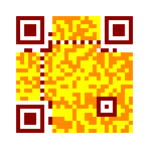

QR Code and Micro QR Code serialization
=======================================

A QR Code or Micro QR Code is independent of its output, it's just a matrix.
To save a QR Code or Micro QR Code, Segno provides several output formats.

Segno provides a :py:func:`segno.QRCode.save` method to serialize the (Micro)
QR Code in different formats:

.. code-block:: python

    >>> import segno
    >>> qr = segno.make('Polly')
    >>> qr.save('polly.svg')
    >>> qr.save('polly.png')
    >>> qr.save('polly.eps')

All serializers accept a ``border`` parameter which indicates the "quiet zone"
of a (Micro) QR Code. If ``border`` is ``None``, the default border (quiet zone)
size will be used. If the resulting (Micro) QR Code should have no border or
a custom border, the user may specify the border explicitly.

.. code-block:: python

    >>> import segno
    >>> qr = segno.make('Vampire Blues')
    >>> qr.save('vampire-blues.svg', border=0)  # No border
    >>> qr.save('vampire-blues.png', border=10)  # Larger border

Most serializers accept a ``scale`` parameter which indicates the scaling
factor of the serialization. By default, the scaling factor is ``1`` which means
that size of a dark / light module is interpreted as one unit in the specific
user space (i.e. 1 pixel for the :ref:`PNG <png>` serializer or
1 point (1/72 of an inch) in :ref:`EPS <eps>`). Some serializers
(like :ref:`PNG <png>`) accept only an integer value or convert the provided
scaling factor to an integer. Other, like :ref:`SVG <svg>` and :ref:`EPS <eps>`,
accept float values and do not "downgrade" it to an integer.

.. code-block:: python

    >>> import segno
    >>> qr = segno.make_qr('The Beatles')
    >>> qr.save('the-beatles.png', scale=1.2)   # No scaling at all since int(1.2) is 1
    >>> qr.save('the-beatles-2.png', scale=10)  # 1 module == 10 pixels
    >>> qr.save('the-beatles.svg', scale=1.2)   # SVG accepts float values
    >>> # The SVG serializer provides the "unit" parameter to specify
    >>> # how to interpret the values
    >>> qr.save('the-beatles-2.svg', scale=10, unit='mm')  # 1 unit = 1 mm
    >>> qr.save('the-beatles-2.svg', unit='cm')  # 1 unit = 1 cm, result as above

Many serializers accept the parameters ``color`` and ``background`` to specify
the color of the dark modules and light modules (background). See :doc:`colors`
for details.

.. code-block:: python

    >>> import segno
    >>> qr = segno.make('Neil Young')
    >>> qr.save('neil-young.svg', color='darkblue', background='yellow')
    >>> qr.save('neil-young.png', color='#ccc')
    >>> qr.save('neil-young-2.png', background=None)  # Transparent background
    >>> # Dark modules = transparent, light modules = black
    >>> qr.save('neil-young-3.png', color=None, background='black')
    >>> # Dark modules with alpha transparency
    >>> qr.save('neil-young-4.png', color='#0000ffcc')
    >>> qr.save('neil-young-4.svg', color='#00fc')  # Same as above but SVG
    >>> # Anonther color, save as compressed SVG
    >>> qr.save('neil-young-5.svgz', color=(8, 90, 117))

If the QR Code should be serialized to a buffer, use the
:paramref:`kind <segno.QRCode.save.kind>`  parameter to specify the output format.
Please note that some serializers write bytes while others write strings, see
:py:meth:`segno.QRCode.save` for details.

.. code-block:: python

    >>> import segno
    >>> import io
    >>> qr = segno.make('Neil Young')
    >>> buff = io.BytesIO()
    >>> qr.save(buff, kind='svg')
    >>> # All other serializer parameters are supported as well
    >>> buff = io.BytesIO()
    >>> qr.save(buff, kind='svg', color='#ccc', background='green')

See :py:meth:`segno.QRCode.save` for a complete reference which parameters are
accepted by the specific serializer.

More colorful QR Codes
----------------------

The PNG serializer supports an optional color mapping which can define a specific
color for each module type.

.. code-block:: python

    >>> import segno
    >>> from segno import moduletypes as mt
    >>> qr = segno.make('Yellow Submarine', error='h')
    >>> colormap = {mt.TYPE_FINDER_PATTERN_DARK:'darkred', mt.TYPE_ALIGNMENT_PATTERN_DARK:'darkred', mt.TYPE_TIMING_DARK: 'darkred', mt.TYPE_DARKMODULE: 'darkred', mt.TYPE_DATA_DARK: 'darkorange', mt.TYPE_DATA_LIGHT: 'yellow', mt.TYPE_FORMAT_DARK: 'darkred'}
    >>> qr.save('yellow-submarine.png', scale=5, colormap=colormap)

Available serializers
---------------------

ANSI
    ANSI escape code. The serializer supports the border keyword, only.
    See :ref:`ANSI <ansi>` for details.

EPS
    Encapsulated PostScript (EPS). The serializer provides all default features
    (scale, border, color and background color), see :ref:`EPS <eps>` for details.

LaTeX
    LaTeX / PGF/TikZ. The serializer provides no background color, but all
    other default features (scale, border, color) are supported, see
    :ref:`LaTeX <latex>` for details.

PAM
    Portable Arbitrary Map (PAM). The serializer provides all default features
    (scale, border, color and background color), see :ref:`PAM <pam>` for details.

PBM
    Portable Bitmap (PBM). The serializer does not support any coloring,
    but the common featurs like scale and border are supported, see :ref:`PBM <pbm>`
    for details.

PDF
    Portable Document Format (PDF). The serializer provides all default features
    (scale, border, color and background color), see :ref:`PDF <pdf>` for details.

PNG
    Portable Network Graphics (PNG). The serializer provides all default features
    (scale, border, color and background color) and a few more to customize the
    output, see :ref:`PNG <png>` for details.

SVG
    Scalable Vector Graphics (SVG). The serializer provides all default features
    (scale, border, color and background color) and many more to customize the
    output, see :ref:`SVG <svg>` for details. SVGZ (compressed SVG) is supported
    as well.

TXT
    Text output. The serializer does not support any scale or color, but the
    character for the dark and white modules may be specified via `color`
    and `background`, see :ref:`TXT <txt>` for details.

XBM
    X BitMap (XBM). The serializer does not support any coloring, but scale
    and border are supported, see :ref:`XBM <xbm>` for details.

XPM
    X PixMap (XPM). The serializer provides all default features
    (scale, border, color and background color) and a few more, see
    :ref:`XPM <xpm>` for details.
