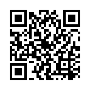
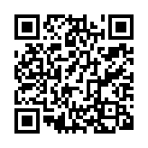
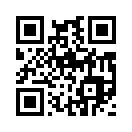
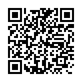

Special QR Code factory functions
=================================

The :py:mod:`segno.helpers` module provides factory functions to create common
QR codes for encoding WIFI configurations, :doc:`vCards and MeCards <contact-information>`,
:doc:`EPC QR Codes <epc-qrcodes>` or `geographic locations <#geographic>`_.

The created QR codes use at minimum the error correction level "L". If a better
error correction level is possible without changing the QR Code version, the
better error correction level will be used.

Create a QR code for a WIFI configuration
-----------------------------------------

.. code-block:: python

    >>> from segno import helpers
    >>> # Create a WIFI config with min. error level "L" or better
    >>> qrcode = helpers.make_wifi(ssid='My network', password='secret', security='WPA')
    >>> qrcode.designator
    '3-M'

If you want more control over the creation of the QR code (i.e. using a specific
version or error correction level, use the :py:func:`segno.helpers.make_wifi_data`
factory function, which returns a string which encodes the WIFI configuration.

.. code-block:: python

    >>> import segno
    >>> from segno import helpers
    >>> config = helpers.make_wifi_data(ssid='My network', password='secret', security='WPA')
    >>> config
    'WIFI:T:WPA;S:My network;P:secret;;'
    >>> # Create a QR Code with error correction level "H"
    >>> qrcode = segno.make(config, error='h')
    >>> qrcode.designator
    '4-H'

.. _geographic:

Create a QR code encoding geographic information
------------------------------------------------

.. code-block:: python

    >>> from segno import helpers
    >>> latitude, longitude = 38.8976763,-77.0365297
    >>> qrcode = helpers.make_geo(latitude, longitude)
    >>> qrcode.designator
    '2-M'

A factory function for encoding the geographic information as string is also
available.

.. code-block:: python

    >>> import segno
    >>> from segno import helpers
    >>> latitude, longitude = 38.8976763, -77.0365297
    >>> geo_uri = helpers.make_geo_data(latitude, longitude)
    >>> geo_uri
    'geo:38.8976763,-77.0365297'
    >>> # Use error correction level "H"
    >>> qrcode = segno.make(geo_uri, error='H')
    >>> qrcode.designator
    '4-H'

