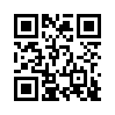

Structured Append
=================

The Structured Append mode can be used to split a message across several
QR codes (it's not available for Micro QR codes).

Example: The 2-L QR code encodes the same information ("I read the news today oh boy")
as the following 1-L QR codes which are using Structured Append:

With Structured Append (version 1):

Segno provides a special factory function, :py:func:`segno.make_sequence`, to
create a sequence of (up to 16) QR codes. The function returns instances of
:py:class:`segno.QRCodeSequence`.

Structured Append by QR Code version
------------------------------------

To create a sequence of QR codes, the QR Code version must be specified. The
number of symbols is automatically determined by the QR Code version.

.. code-block:: python

    >>> import segno
    >>> qrcode_seq = segno.make_sequence('I read the news today oh boy', version=1)
    >>> len(qrcode_seq)
    2
    >>> # Creates "a-day-in-the-life-02-01.svg" and "a-day-in-the-life-02-02.svg"
    >>> qrcode_seq.save('a-day-in-the-life.svg', scale=10)

If the provided content fits into one QR code, the sequence behaves like a
:py:class:`segno.QRCode` instance.

.. code-block:: python

    >>> import segno
    >>> qrcode_seq = segno.make_sequence('I read', version=1)
    >>> len(qrcode_seq)
    1
    >>> qrcode_seq.designator
    '1-H'
    >>> # Creates "a-day-in-the-life.svg"
    >>> qrcode_seq.save('a-day-in-the-life.svg', scale=10)

Structured Append by number of symbols
--------------------------------------

The number of desired QR code symbols may be specified directly. The utilized
QR Code version is automatically determined by the number of symbols.

.. code-block:: python

    >>> import segno
    >>> qrcode_seq = segno.make_sequence('Day after day, alone on the hill', symbol_count=4)
    >>> [qrcode.designator for qr in seq]
    ['1-Q', '1-Q', '1-Q', '1-Q']
    >>> qrcode_seq = segno.make_sequence('Day after day, alone on the hill', symbol_count=2)
    >>> [qrcode.designator for qr in seq]
    ['2-Q', '2-Q']
    >>> qrcode_seq = segno.make_sequence('Day after day, alone on the hill', symbol_count=6)
    >>> [qrcode.designator for qr in seq]
    ['1-Q', '1-Q', '1-H', '1-H', '1-H', '1-H']

Example: The 6-L QR code encodes the same information (first verse of the song "Yesterday")
as the four 2-L QR codes.

The following 2-L QR codes were created by specifying that 4 codes should be generated
(:paramref:`symbol_count=4 <segno.make_sequence.symbol_count>` ).
The result would be the same if the user specifies that a sequence of QR codes
with version 2 should be created.

.. image:: _static/sa/structured_append_example_2_2-L-04-04.svg
    :alt: 2-L QR code encoding first verse of 'Yesterday' part 4/4
