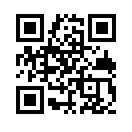

SVG Options
===========

All options of the :doc:`colorful-qrcodes` are supported. Additionally, the
following options are provided by the SVG serializer.

Options
-------

xmldecl
~~~~~~~
Boolean (default: ``True``) to enable (default) or omit
(CLI: :option:`--no-xmldecl <segno --no-xmldecl>`) the XML declaration

svgns
~~~~~
Boolean to enable (default) or omit (CLI: :option:`--no-namespace <segno --no-namespace>`)
the SVG namespace declaration.

svgid / :option:`--svgid <segno --svgid>`
~~~~~~~~~~~~~~~~~~~~~~~~~~~~~~~~~~~~~~~~~
String (default: ``None``).
CSS identifier of the ``svg`` element.

svgclass / :option:`--svgclass <segno --svgclass>`
~~~~~~~~~~~~~~~~~~~~~~~~~~~~~~~~~~~~~~~~~~~~~~~~~~
String (default: "segno").
CSS class of the ``svg`` element. Use ``None`` or an empty string to omit the
attribute.

lineclass / :option:`--lineclass <segno --lineclass>`
~~~~~~~~~~~~~~~~~~~~~~~~~~~~~~~~~~~~~~~~~~~~~~~~~~~~~
String (default: "qrline").
CSS class of all paths. Use ``None`` or an empty string to omit the attribute.

omitsize / :option:`--no-size <segno --no-size>`
~~~~~~~~~~~~~~~~~~~~~~~~~~~~~~~~~~~~~~~~~~~~~~~~
Boolean to disable the ``width`` and ``height`` attributes
(CLI: :option:`--no-size <segno --no-size>`).

If set to ``True`` (default: ``False``) the attributes will be replaced by
a ``viewBox`` attribute.

nl
~~
Boolean (default: ``True``) to enable / disable a trailing new line character
(``\n``) at the end of the document. It's enabled by default. Set to ``False``
(CLI: :option:`--no-newline <segno --no-newline>`) to omit it.

title / :option:`--title <segno --title>`
~~~~~~~~~~~~~~~~~~~~~~~~~~~~~~~~~~~~~~~~~
String (default: ``None``).

Sets the title of the graphic. If empty or ``None``, the title is omitted.

desc / :option:`--desc <segno --desc>`
~~~~~~~~~~~~~~~~~~~~~~~~~~~~~~~~~~~~~~
String (default: ``None``).

Sets the description of the graphic. If empty or ``None``, the description is
omitted.

unit / :option:`--unit <segno --unit>`
~~~~~~~~~~~~~~~~~~~~~~~~~~~~~~~~~~~~~~
String (default: ``None``).

Sets the unit of the ``width`` / ``height`` attributes. The unit is not checked,
any non empty value is used as appendix to the numeric width / height attributes.
Common values are "mm" or "cm".

encoding / :option:`--encoding <segno --encoding>`
~~~~~~~~~~~~~~~~~~~~~~~~~~~~~~~~~~~~~~~~~~~~~~~~~~
String (default: "utf--8").

Sets the encoding of the XML document. If set to ``None``, the encoding
parameter of the XML declaration is omitted but the XML default encoding "UTF-8"
is used.

    .. note::
        It is not recommended to set the encoding to another value than "utf-8"
        if ``xmldecl`` is set to ``False``.

draw_transparent
~~~~~~~~~~~~~~~~
Boolean (default: ``False``).

Set to ``True`` (CLI: :option:`--draw-transparent <segno --draw-transparent>` to
draw transparent paths.

svgversion / :option:`--svgversion <segno --svgversion>`
~~~~~~~~~~~~~~~~~~~~~~~~~~~~~~~~~~~~~~~~~~~~~~~~~~~~~~~~
:class:`int` or :class:`float` (default: ``None``)

Sets the SVG ``version`` attribute.
By default, the attribute is omitted. Any given value is converted into a string.
The value may have an impact on the generated paths since this lib assumes that
a value lesser than ``2`` does not support `CSS Color Module Level 3 <https://www.w3.org/TR/2018/REC-css-color-3-20180619/>`_.

    .. note::
        It's recommended to keep the default value.

Optimizing SVG
--------------

The SVG serializer supports several options to optimize the output.
By default, a minimal, standalone SVG graphic is generated which includes
the XML declaration, the SVG namespace and a trailing newline.

.. code-block:: python

    >>> import segno
    >>> qr = segno.make('Penny Lane', error='h')
    >>> qr.save('penny-lane.svg', scale=4)

XML markup:

.. code-block:: xml

    <?xml version="1.0" encoding="utf-8"?>
    <svg xmlns="http://www.w3.org/2000/svg" width="132" height="132" class="segno"><path transform="scale(4)" stroke="#000" class="qrline" d="M4 4.5h7m3 0h1m1 0h1m1 0h1m3 0h7m-25 1h1m5 0h1m3 0h2m1 0h4m1 0h1m5 0h1m-25 1h1m1 0h3m1 0h1m2 0h2m5 0h1m1 0h1m1 0h3m1 0h1m-25 1h1m1 0h3m1 0h1m2 0h2m1 0h1m1 0h1m3 0h1m1 0h3m1 0h1m-25 1h1m1 0h3m1 0h1m1 0h2m4 0h3m1 0h1m1 0h3m1 0h1m-25 1h1m5 0h1m2 0h1m2 0h2m2 0h1m1 0h1m5 0h1m-25 1h7m1 0h1m1 0h1m1 0h1m1 0h1m1 0h1m1 0h7m-17 1h1m2 0h1m1 0h4m-15 1h2m2 0h5m3 0h1m1 0h3m1 0h1m-19 1h2m1 0h1m1 0h10m2 0h1m2 0h1m-23 1h2m1 0h5m1 0h1m1 0h1m1 0h1m2 0h1m5 0h1m-23 1h1m1 0h3m2 0h1m2 0h3m1 0h2m1 0h1m2 0h4m-24 1h1m1 0h1m1 0h1m1 0h2m3 0h2m1 0h1m3 0h1m1 0h5m-21 1h1m2 0h4m1 0h3m1 0h2m1 0h6m-24 1h1m1 0h1m1 0h5m1 0h3m1 0h2m6 0h1m-24 1h1m2 0h2m2 0h1m3 0h1m4 0h1m1 0h1m5 0h1m-22 1h1m2 0h2m2 0h1m2 0h11m-16 1h1m2 0h1m1 0h1m1 0h2m3 0h1m2 0h1m-24 1h7m1 0h5m2 0h2m1 0h1m1 0h1m2 0h2m-25 1h1m5 0h1m4 0h1m1 0h2m1 0h1m3 0h1m2 0h2m-25 1h1m1 0h3m1 0h1m6 0h1m2 0h5m3 0h1m-25 1h1m1 0h3m1 0h1m1 0h2m3 0h1m4 0h1m1 0h2m2 0h1m-25 1h1m1 0h3m1 0h1m1 0h7m2 0h1m1 0h2m2 0h1m-24 1h1m5 0h1m2 0h2m2 0h1m2 0h4m1 0h2m-23 1h7m5 0h1m1 0h1m1 0h1m2 0h3m1 0h2"/></svg>

To suppress the XML declaration, use ``xmldecl=False``.

.. code-block:: python

    >>> import segno
    >>> qr = segno.make('Penny Lane', error='h')
    >>> qr.save('penny-lane.svg', scale=4, xmldecl=False)

XML markup:

.. code-block:: xml

    <svg xmlns="http://www.w3.org/2000/svg" width="132" height="132" class="segno"><path transform="scale(4)" stroke="#000" class="qrline" d="M4 4.5h7m3 0h1m1 0h1m1 0h1m3 0h7m-25 1h1m5 0h1m3 0h2m1 0h4m1 0h1m5 0h1m-25 1h1m1 0h3m1 0h1m2 0h2m5 0h1m1 0h1m1 0h3m1 0h1m-25 1h1m1 0h3m1 0h1m2 0h2m1 0h1m1 0h1m3 0h1m1 0h3m1 0h1m-25 1h1m1 0h3m1 0h1m1 0h2m4 0h3m1 0h1m1 0h3m1 0h1m-25 1h1m5 0h1m2 0h1m2 0h2m2 0h1m1 0h1m5 0h1m-25 1h7m1 0h1m1 0h1m1 0h1m1 0h1m1 0h1m1 0h7m-17 1h1m2 0h1m1 0h4m-15 1h2m2 0h5m3 0h1m1 0h3m1 0h1m-19 1h2m1 0h1m1 0h10m2 0h1m2 0h1m-23 1h2m1 0h5m1 0h1m1 0h1m1 0h1m2 0h1m5 0h1m-23 1h1m1 0h3m2 0h1m2 0h3m1 0h2m1 0h1m2 0h4m-24 1h1m1 0h1m1 0h1m1 0h2m3 0h2m1 0h1m3 0h1m1 0h5m-21 1h1m2 0h4m1 0h3m1 0h2m1 0h6m-24 1h1m1 0h1m1 0h5m1 0h3m1 0h2m6 0h1m-24 1h1m2 0h2m2 0h1m3 0h1m4 0h1m1 0h1m5 0h1m-22 1h1m2 0h2m2 0h1m2 0h11m-16 1h1m2 0h1m1 0h1m1 0h2m3 0h1m2 0h1m-24 1h7m1 0h5m2 0h2m1 0h1m1 0h1m2 0h2m-25 1h1m5 0h1m4 0h1m1 0h2m1 0h1m3 0h1m2 0h2m-25 1h1m1 0h3m1 0h1m6 0h1m2 0h5m3 0h1m-25 1h1m1 0h3m1 0h1m1 0h2m3 0h1m4 0h1m1 0h2m2 0h1m-25 1h1m1 0h3m1 0h1m1 0h7m2 0h1m1 0h2m2 0h1m-24 1h1m5 0h1m2 0h2m2 0h1m2 0h4m1 0h2m-23 1h7m5 0h1m1 0h1m1 0h1m2 0h3m1 0h2"/></svg>

If the SVG graphic should be embedded into a HTML5 context, the namespace
declaration is superfluous, omit it via ``svgns=False``.

.. code-block:: python

    >>> import segno
    >>> qr = segno.make('Penny Lane', error='h')
    >>> qr.save('penny-lane.svg', scale=4, xmldecl=False, svgns=False)

XML markup:

.. code-block:: xml

    <svg width="132" height="132" class="segno"><path transform="scale(4)" stroke="#000" class="qrline" d="M4 4.5h7m3 0h1m1 0h1m1 0h1m3 0h7m-25 1h1m5 0h1m3 0h2m1 0h4m1 0h1m5 0h1m-25 1h1m1 0h3m1 0h1m2 0h2m5 0h1m1 0h1m1 0h3m1 0h1m-25 1h1m1 0h3m1 0h1m2 0h2m1 0h1m1 0h1m3 0h1m1 0h3m1 0h1m-25 1h1m1 0h3m1 0h1m1 0h2m4 0h3m1 0h1m1 0h3m1 0h1m-25 1h1m5 0h1m2 0h1m2 0h2m2 0h1m1 0h1m5 0h1m-25 1h7m1 0h1m1 0h1m1 0h1m1 0h1m1 0h1m1 0h7m-17 1h1m2 0h1m1 0h4m-15 1h2m2 0h5m3 0h1m1 0h3m1 0h1m-19 1h2m1 0h1m1 0h10m2 0h1m2 0h1m-23 1h2m1 0h5m1 0h1m1 0h1m1 0h1m2 0h1m5 0h1m-23 1h1m1 0h3m2 0h1m2 0h3m1 0h2m1 0h1m2 0h4m-24 1h1m1 0h1m1 0h1m1 0h2m3 0h2m1 0h1m3 0h1m1 0h5m-21 1h1m2 0h4m1 0h3m1 0h2m1 0h6m-24 1h1m1 0h1m1 0h5m1 0h3m1 0h2m6 0h1m-24 1h1m2 0h2m2 0h1m3 0h1m4 0h1m1 0h1m5 0h1m-22 1h1m2 0h2m2 0h1m2 0h11m-16 1h1m2 0h1m1 0h1m1 0h2m3 0h1m2 0h1m-24 1h7m1 0h5m2 0h2m1 0h1m1 0h1m2 0h2m-25 1h1m5 0h1m4 0h1m1 0h2m1 0h1m3 0h1m2 0h2m-25 1h1m1 0h3m1 0h1m6 0h1m2 0h5m3 0h1m-25 1h1m1 0h3m1 0h1m1 0h2m3 0h1m4 0h1m1 0h2m2 0h1m-25 1h1m1 0h3m1 0h1m1 0h7m2 0h1m1 0h2m2 0h1m-24 1h1m5 0h1m2 0h2m2 0h1m2 0h4m1 0h2m-23 1h7m5 0h1m1 0h1m1 0h1m2 0h3m1 0h2"/></svg>

By default, Segno adds a ``class`` attribute to the ``svg`` element, further, it
adds a ``class`` attribute to all paths. To omit the ``class`` attribute of the
``svg`` element, use ``svgclass=None``. To omit the ``class`` attribute of the
paths, use ``lineclass=None``.

.. code-block:: python

    >>> import segno
    >>> qr = segno.make('Penny Lane', error='h')
    >>> qr.save('penny-lane.svg', scale=4, xmldecl=False, svgns=False, svgclass=None, lineclass=None)

.. code-block:: xml

    <svg width="132" height="132"><path transform="scale(4)" stroke="#000" d="M4 4.5h7m3 0h1m1 0h1m1 0h1m3 0h7m-25 1h1m5 0h1m3 0h2m1 0h4m1 0h1m5 0h1m-25 1h1m1 0h3m1 0h1m2 0h2m5 0h1m1 0h1m1 0h3m1 0h1m-25 1h1m1 0h3m1 0h1m2 0h2m1 0h1m1 0h1m3 0h1m1 0h3m1 0h1m-25 1h1m1 0h3m1 0h1m1 0h2m4 0h3m1 0h1m1 0h3m1 0h1m-25 1h1m5 0h1m2 0h1m2 0h2m2 0h1m1 0h1m5 0h1m-25 1h7m1 0h1m1 0h1m1 0h1m1 0h1m1 0h1m1 0h7m-17 1h1m2 0h1m1 0h4m-15 1h2m2 0h5m3 0h1m1 0h3m1 0h1m-19 1h2m1 0h1m1 0h10m2 0h1m2 0h1m-23 1h2m1 0h5m1 0h1m1 0h1m1 0h1m2 0h1m5 0h1m-23 1h1m1 0h3m2 0h1m2 0h3m1 0h2m1 0h1m2 0h4m-24 1h1m1 0h1m1 0h1m1 0h2m3 0h2m1 0h1m3 0h1m1 0h5m-21 1h1m2 0h4m1 0h3m1 0h2m1 0h6m-24 1h1m1 0h1m1 0h5m1 0h3m1 0h2m6 0h1m-24 1h1m2 0h2m2 0h1m3 0h1m4 0h1m1 0h1m5 0h1m-22 1h1m2 0h2m2 0h1m2 0h11m-16 1h1m2 0h1m1 0h1m1 0h2m3 0h1m2 0h1m-24 1h7m1 0h5m2 0h2m1 0h1m1 0h1m2 0h2m-25 1h1m5 0h1m4 0h1m1 0h2m1 0h1m3 0h1m2 0h2m-25 1h1m1 0h3m1 0h1m6 0h1m2 0h5m3 0h1m-25 1h1m1 0h3m1 0h1m1 0h2m3 0h1m4 0h1m1 0h2m2 0h1m-25 1h1m1 0h3m1 0h1m1 0h7m2 0h1m1 0h2m2 0h1m-24 1h1m5 0h1m2 0h2m2 0h1m2 0h4m1 0h2m-23 1h7m5 0h1m1 0h1m1 0h1m2 0h3m1 0h2"/></svg>

To replace the ``width`` and ``height`` attributes with ``viewBox``, use ``omitsize=True``.
Since the graphic should take all available space, the ``scale`` may be omitted, too.

.. code-block:: python

    >>> import segno
    >>> qr = segno.make('Penny Lane', error='h')
    >>> qr.save('penny-lane.svg', xmldecl=False, svgns=False, svgclass=None, lineclass=None, omitsize=True)

XML markup.

.. code-block:: xml

    <svg viewBox="0 0 33 33"><path stroke="#000" d="M4 4.5h7m3 0h1m1 0h1m1 0h1m3 0h7m-25 1h1m5 0h1m3 0h2m1 0h4m1 0h1m5 0h1m-25 1h1m1 0h3m1 0h1m2 0h2m5 0h1m1 0h1m1 0h3m1 0h1m-25 1h1m1 0h3m1 0h1m2 0h2m1 0h1m1 0h1m3 0h1m1 0h3m1 0h1m-25 1h1m1 0h3m1 0h1m1 0h2m4 0h3m1 0h1m1 0h3m1 0h1m-25 1h1m5 0h1m2 0h1m2 0h2m2 0h1m1 0h1m5 0h1m-25 1h7m1 0h1m1 0h1m1 0h1m1 0h1m1 0h1m1 0h7m-17 1h1m2 0h1m1 0h4m-15 1h2m2 0h5m3 0h1m1 0h3m1 0h1m-19 1h2m1 0h1m1 0h10m2 0h1m2 0h1m-23 1h2m1 0h5m1 0h1m1 0h1m1 0h1m2 0h1m5 0h1m-23 1h1m1 0h3m2 0h1m2 0h3m1 0h2m1 0h1m2 0h4m-24 1h1m1 0h1m1 0h1m1 0h2m3 0h2m1 0h1m3 0h1m1 0h5m-21 1h1m2 0h4m1 0h3m1 0h2m1 0h6m-24 1h1m1 0h1m1 0h5m1 0h3m1 0h2m6 0h1m-24 1h1m2 0h2m2 0h1m3 0h1m4 0h1m1 0h1m5 0h1m-22 1h1m2 0h2m2 0h1m2 0h11m-16 1h1m2 0h1m1 0h1m1 0h2m3 0h1m2 0h1m-24 1h7m1 0h5m2 0h2m1 0h1m1 0h1m2 0h2m-25 1h1m5 0h1m4 0h1m1 0h2m1 0h1m3 0h1m2 0h2m-25 1h1m1 0h3m1 0h1m6 0h1m2 0h5m3 0h1m-25 1h1m1 0h3m1 0h1m1 0h2m3 0h1m4 0h1m1 0h2m2 0h1m-25 1h1m1 0h3m1 0h1m1 0h7m2 0h1m1 0h2m2 0h1m-24 1h1m5 0h1m2 0h2m2 0h1m2 0h4m1 0h2m-23 1h7m5 0h1m1 0h1m1 0h1m2 0h3m1 0h2"/></svg>

Too squeeze the file size futher, omit the trailing newline character via ``nl=False``.

.. code-block:: python

    >>> import segno
    >>> qr = segno.make('Penny Lane', error='h')
    >>> qr.save('penny-lane.svg', xmldecl=False, svgns=False, svgclass=None, lineclass=None, omitsize=True, nl=False)

The result is almost he same, but you've saved a few (abt. 130) bytes

.. raw:: html
    :file: _static/svg/penny-lane-optimized.svg
